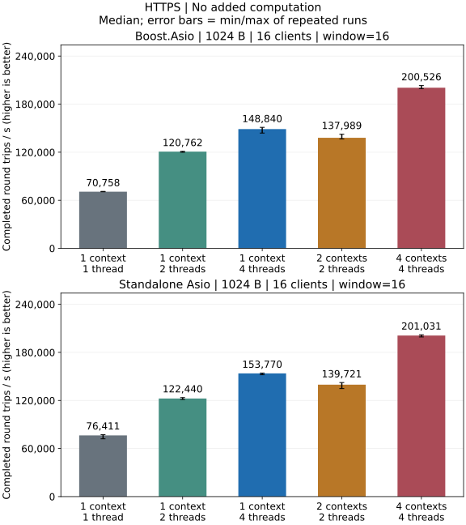
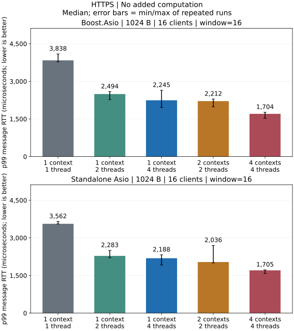

# HTTP 与 HTTPS 性能

[介绍](../http_CN.md) | [使用](usage_CN.md)

## 本机测量结果

Release 本机回环测试：HTTP/1.1 POST 回显 1024 字节请求体、16 个客户端、窗口 16，无额外业务计算。

### HTTP


- 两种后端都以 4 个 io_context 各 1 个线程的吞吐量中位数最高、p99 中位数最低。
- 从 1 个 io_context、2 个线程增加到 1 个 io_context、4 个线程时，吞吐量中位数提高，p99 中位数也提高；p99 运行范围重叠。

[完整 HTTP 报告](../performance/http_CN.md)

### HTTPS





- 两种后端都以 4 个 io_context 各 1 个线程的吞吐量中位数最高、p99 中位数最低。
- 同一负载与线程模型下，HTTPS 的吞吐量中位数低于 HTTP。

[完整 HTTPS 报告](../performance/https_CN.md) · [测试环境](../performance/overview_CN.md) · [指标与统计口径](../testing_CN.md)

[包体、批量与执行方式对比](../performance/dimensions_CN.md#http) · [HTTPS 对比](../performance/dimensions_CN.md#https)

## 复现

在仓库根目录构建。测试 Boost 时，将 Asio 头文件路径参数替换为 `-DARKNET_USE_BOOST_ASIO=ON`。
使用 Visual Studio 时，在构建命令中加入 `--config Release`，并运行
`benchmarks/Release/` 下带 `.exe` 后缀的程序。

```sh
cmake -S . -B build -DCMAKE_BUILD_TYPE=Release \
  -DARKNET_ENABLE_SSL=ON -DARKNET_BUILD_BENCHMARKS=ON \
  -DARKNET_ASIO_INCLUDE_DIR=/path/to/asio/include
cmake --build build --target arknet_loopback_benchmark --parallel 3
for repetition in 1 2 3; do
  for protocol in http https; do
    build/benchmarks/arknet_loopback_benchmark \
      --protocol "$protocol" --certs tests/certs \
      --payload 1024 --clients 16 --window 16 \
      --io-model shared --io-threads 1 --work 0 --warmup 0.25 --seconds 1 \
      > "build/${protocol}-${repetition}.json" || exit 1
  done
done
```

这个循环使用 1024 字节请求体、16 个客户端、窗口 16、1 个 context 和 1 个线程，
通过 keep-alive 连接比较 HTTP 和 HTTPS。每种协议用独立进程测量三次，分别保存每次结果。
将 `--io-threads` 改为 2 或 4 可比较共享 context，使用
`--io-model sharded --io-threads 4` 可比较 4 个 context 各 1 个线程。
完整 shell 矩阵见[测试](../testing_CN.md#性能矩阵)。HTTPS 在相同请求／响应上增加 TLS；
每连接保留 16 个未完成请求，RTT 包含流水线排队时间。测试证书仅用于本地回环。

路由处理在会话的串行通道中运行，增加线程无法并行执行同一连接的 HTTP/1 响应流，业务选择见 [IO 模型](../threading_CN.md)。

测试包含解析、序列化、发送队列与调度，未单独量化路由分发或 TLS 握手速率，应使用实际路由表和中间件复测。HTTP/2、HTTP/3 仍为 [TODO](../roadmap_CN.md)，没有对应性能结果。
