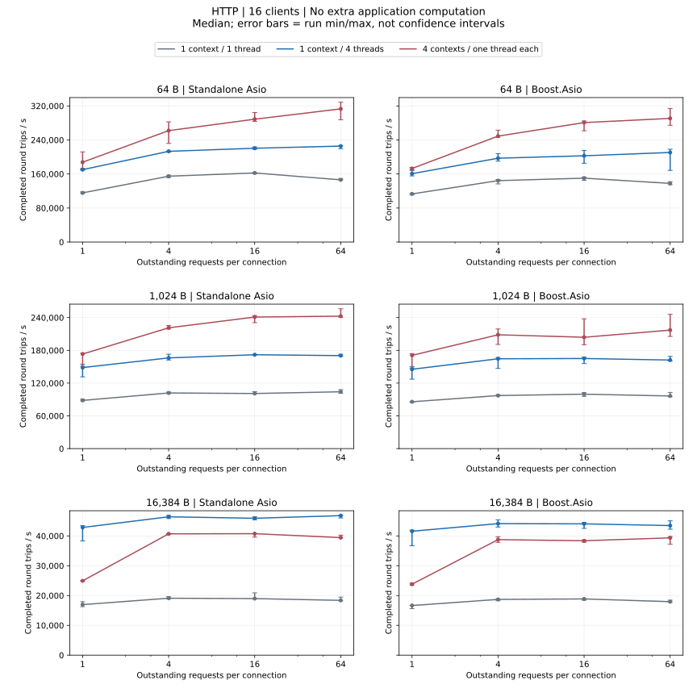
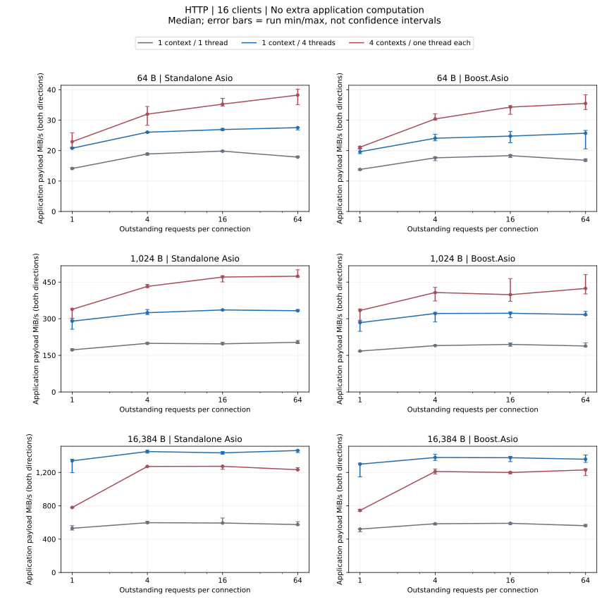
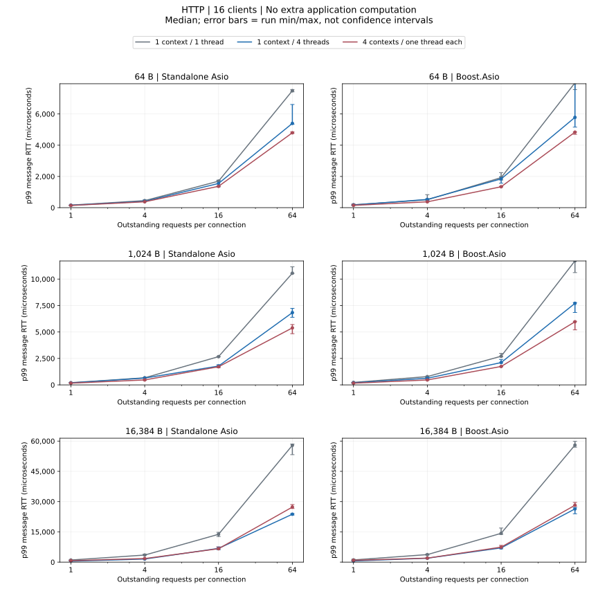

# HTTP 负载对比

16 个客户端；消息为 64/1024/16384 字节，窗口为 1/4/16/64；每个配置重复三次。

## 无额外业务计算

- Standalone Asio: 1024 字节时，吞吐量中位数最高为 4 个 io_context 各 1 个线程、窗口 64；p99 中位数最低为 4 个 io_context 各 1 个线程、窗口 1。
- Boost.Asio: 1024 字节时，吞吐量中位数最高为 4 个 io_context 各 1 个线程、窗口 64；p99 中位数最低为 4 个 io_context 各 1 个线程、窗口 1。

[完整数值 JSON（含 p95、运行范围与失败记录）](dimensions-summary.json ':ignore')

## 失败配置

本协议没有失败配置。

任一次重复失败，该配置的三次测量均不进入吞吐量、延迟或匹配倍率统计；原始数据保留失败记录。

[指标、统计口径与复现](../testing_CN.md)
