# Native Asio TCP: Callbacks and Coroutines Load Comparison

16 clients; 64/1024/16384-byte messages; windows 1/4/16/64; three repetitions per configuration.

Both executions use native Asio and fixed-size TCP batches: the server reads a complete batch, applies the same computation to each message, then writes the entire reply. Window 1 records message RTT; larger windows record batch RTT. The public arknet coroutine endpoint API remains TODO.

Average process CPU uses 100% for one logical CPU and can exceed 100% with multiple threads; legacy values are marked estimated, and incomplete sets of three CPU samples show N/A. On this 14-logical-CPU host, machine share = process CPU% / 14; 100% of one CPU is 7.14% of the machine.

## No extra application computation

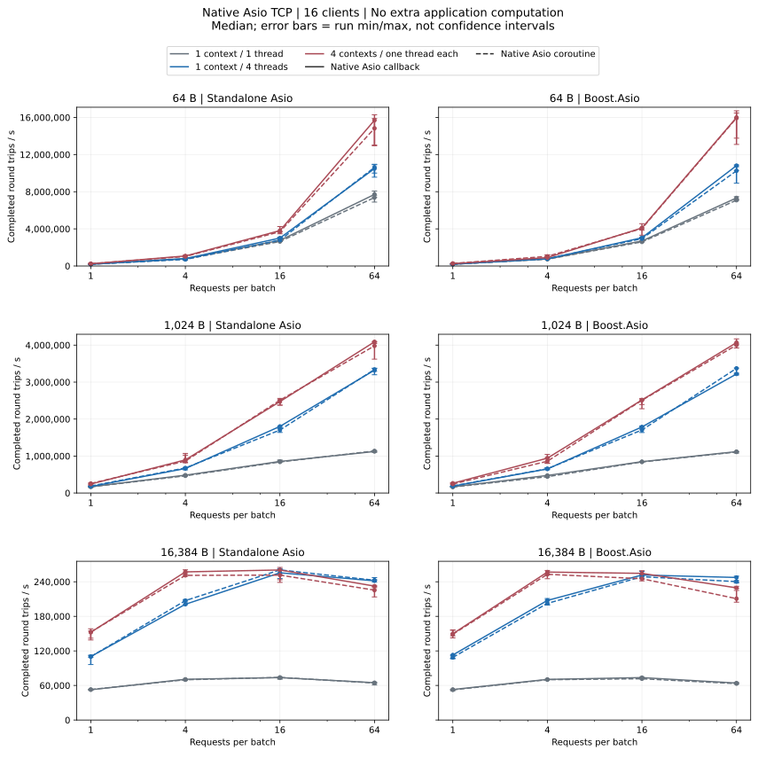

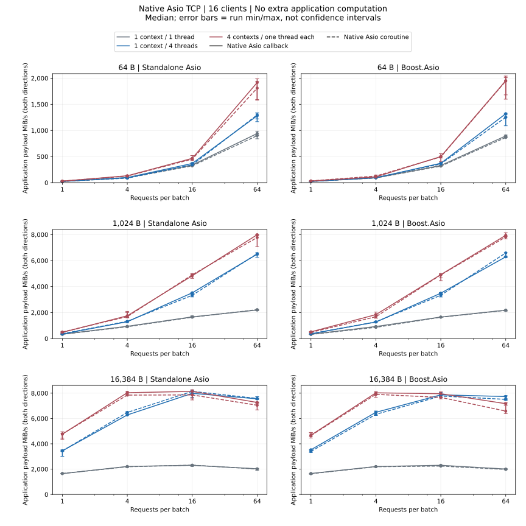

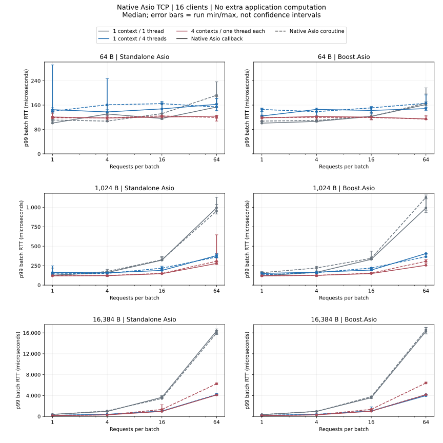

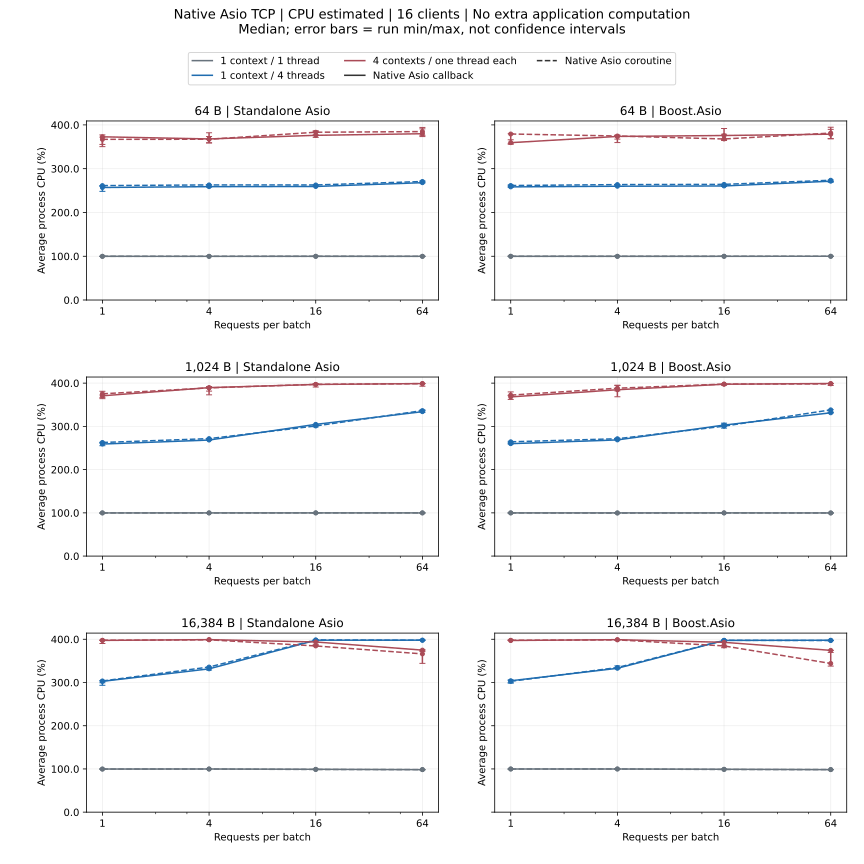

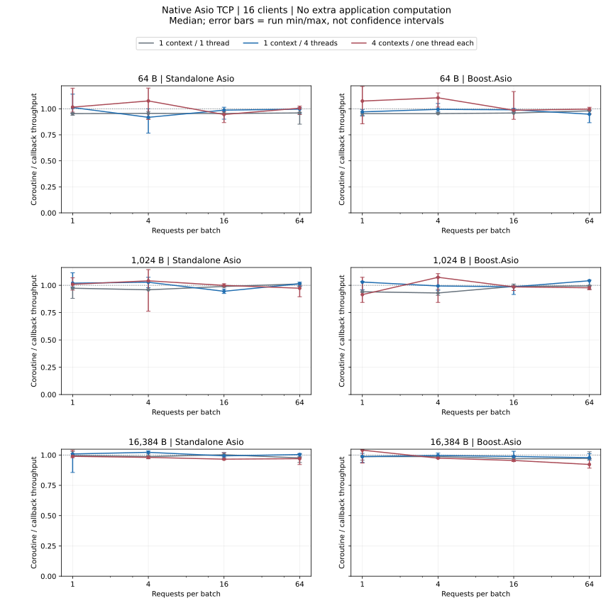

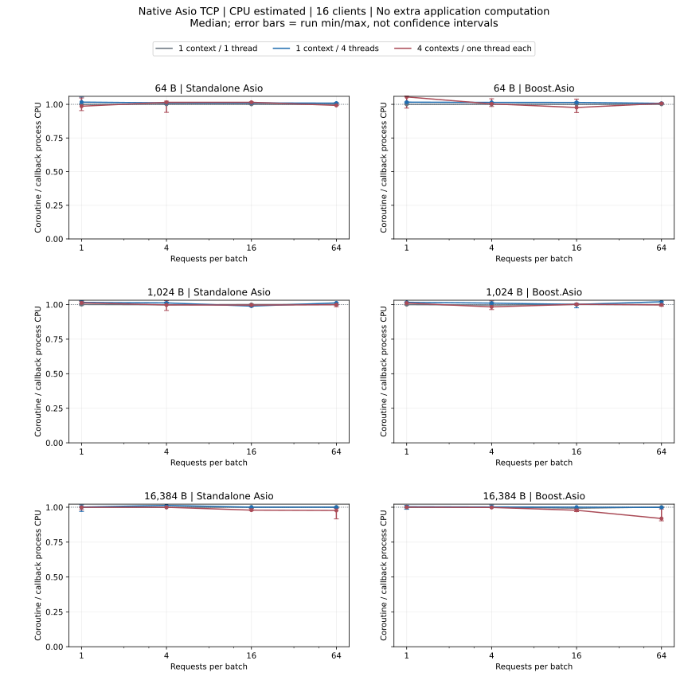

- Standalone Asio: Matched coroutine/callback throughput medians range from 0.92× to 1.08×.
- Standalone Asio: Matched coroutine/callback CPU medians range from 0.98× to 1.02×; below 1 means lower average process CPU. Compare with the throughput ratio.
- Boost.Asio: Matched coroutine/callback throughput medians range from 0.92× to 1.11×.
- Boost.Asio: Matched coroutine/callback CPU medians range from 0.92× to 1.05×; below 1 means lower average process CPU. Compare with the throughput ratio.

## 10,000 deterministic iterations per echo

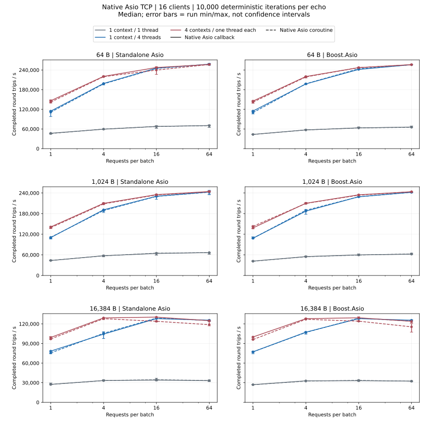

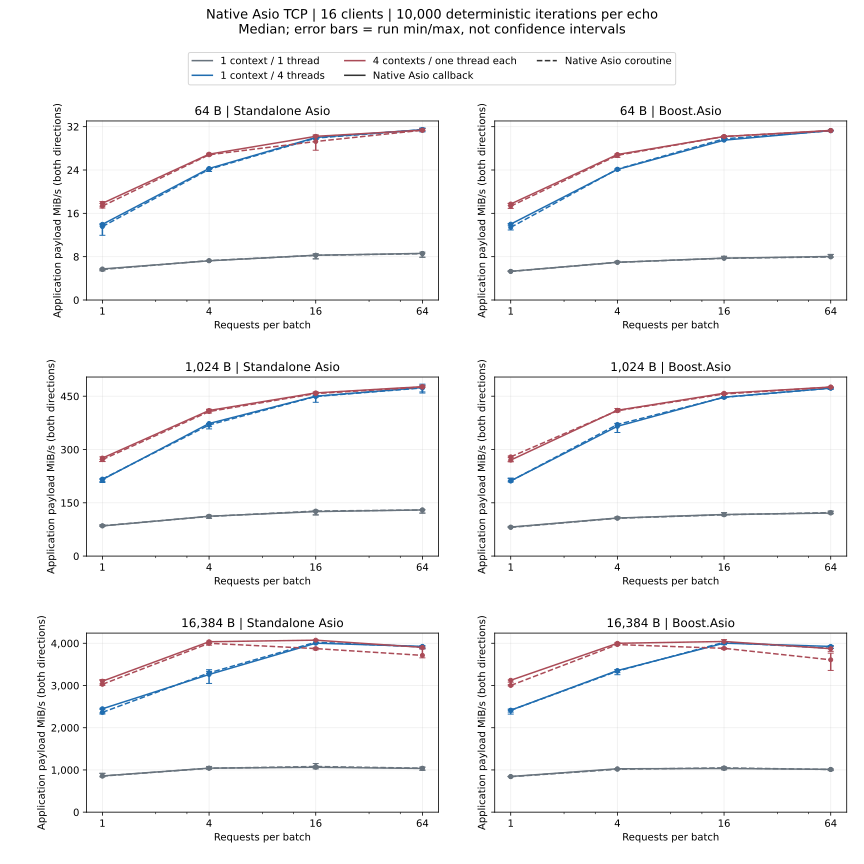

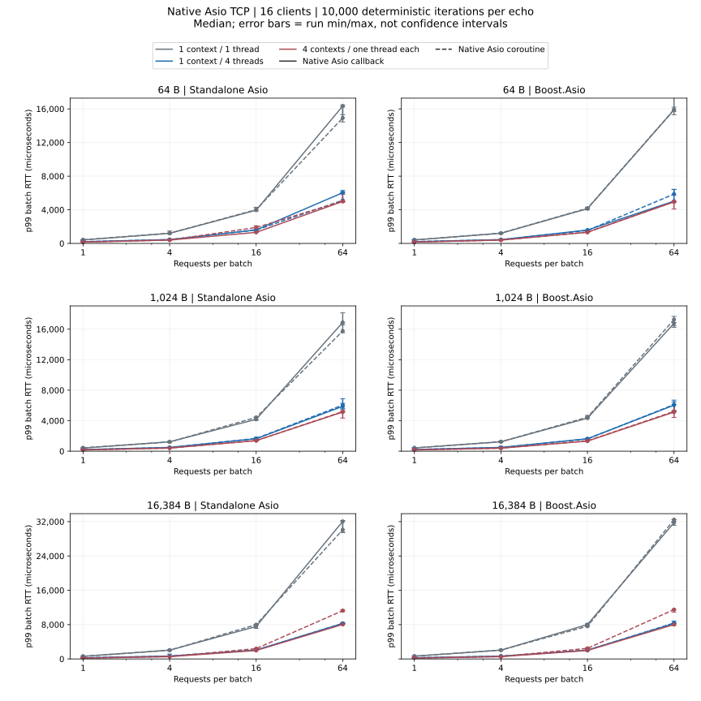

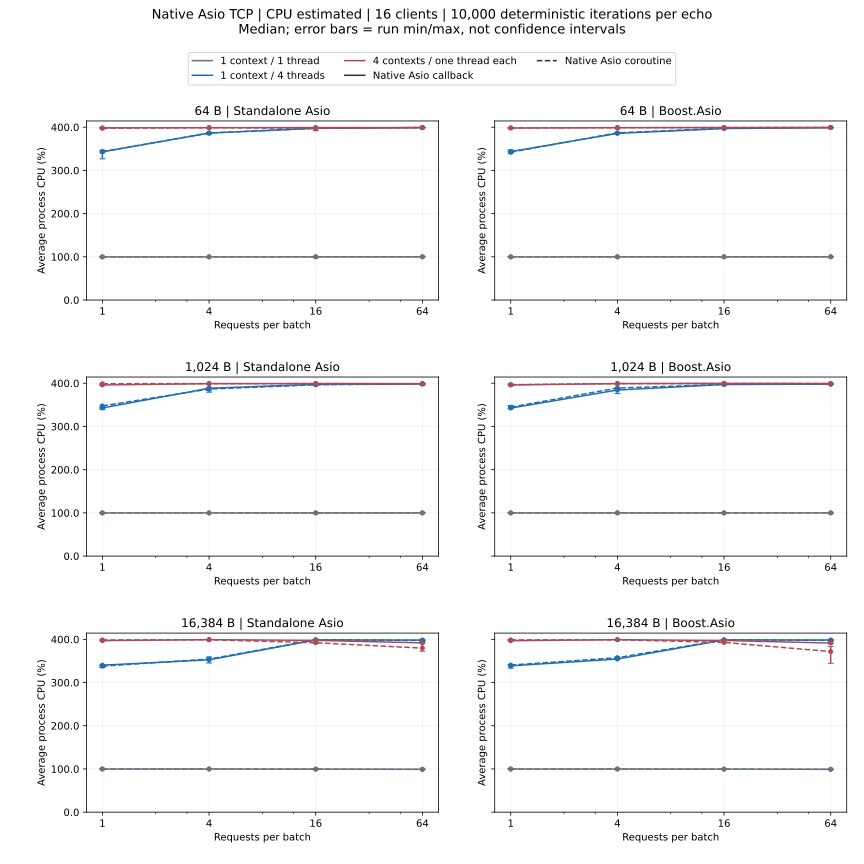

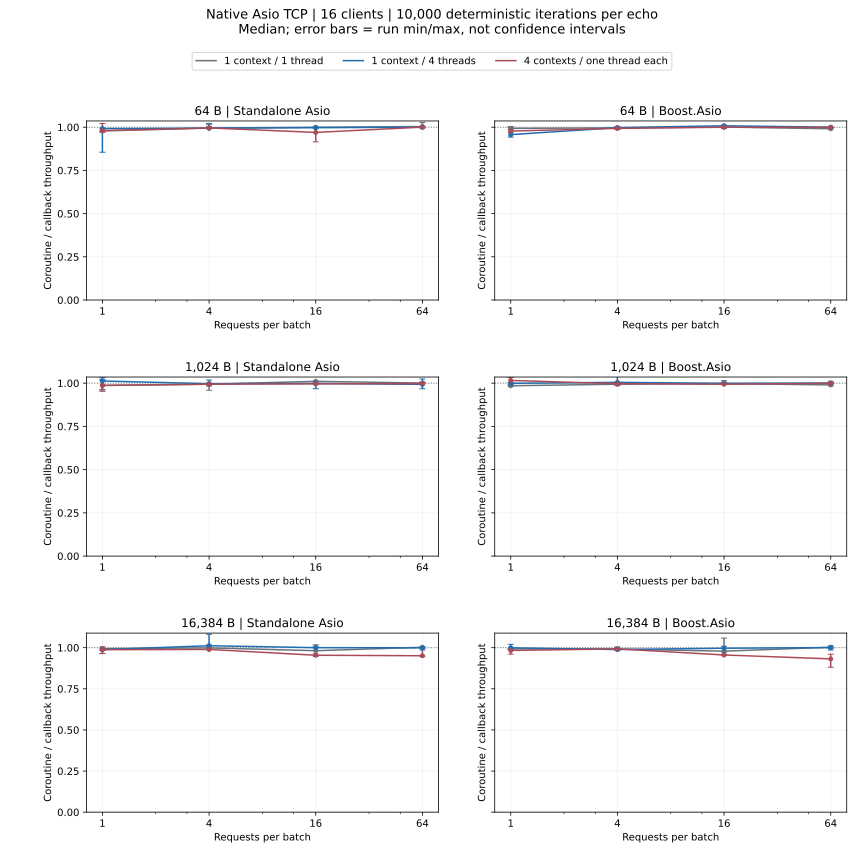

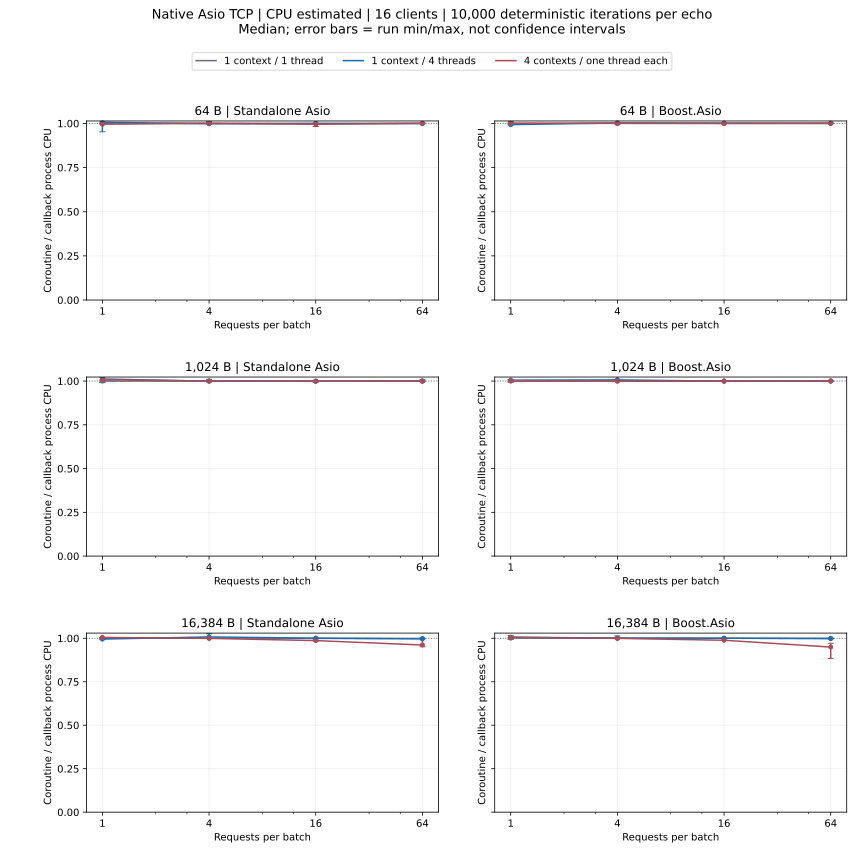

- Standalone Asio: Matched coroutine/callback throughput medians range from 0.95× to 1.01×.
- Standalone Asio: Matched coroutine/callback CPU medians range from 0.96× to 1.01×; below 1 means lower average process CPU. Compare with the throughput ratio.
- Boost.Asio: Matched coroutine/callback throughput medians range from 0.93× to 1.02×.
- Boost.Asio: Matched coroutine/callback CPU medians range from 0.95× to 1.01×; below 1 means lower average process CPU. Compare with the throughput ratio.

[Complete numeric JSON (p95, run ranges and failures)](dimensions-summary.json ':ignore')

## Failed Profiles

No failed profiles for this protocol.

If any repetition fails, all three measurements for that profile are excluded from rate, latency and matched-ratio summaries; raw failures are retained.

Throughput and CPU ratios pair repetitions at the same backend, payload, batch size, thread model and computation before taking the median; 1 means equal values. Lower CPU utilization does not necessarily complete more requests; compare throughput too. If any CPU sample is missing, its CPU summary and matched ratio are N/A while throughput may remain valid. These results do not predict arknet callback endpoint versus future coroutine API speed.

[Metrics, statistics and reproduction](../testing.md)
