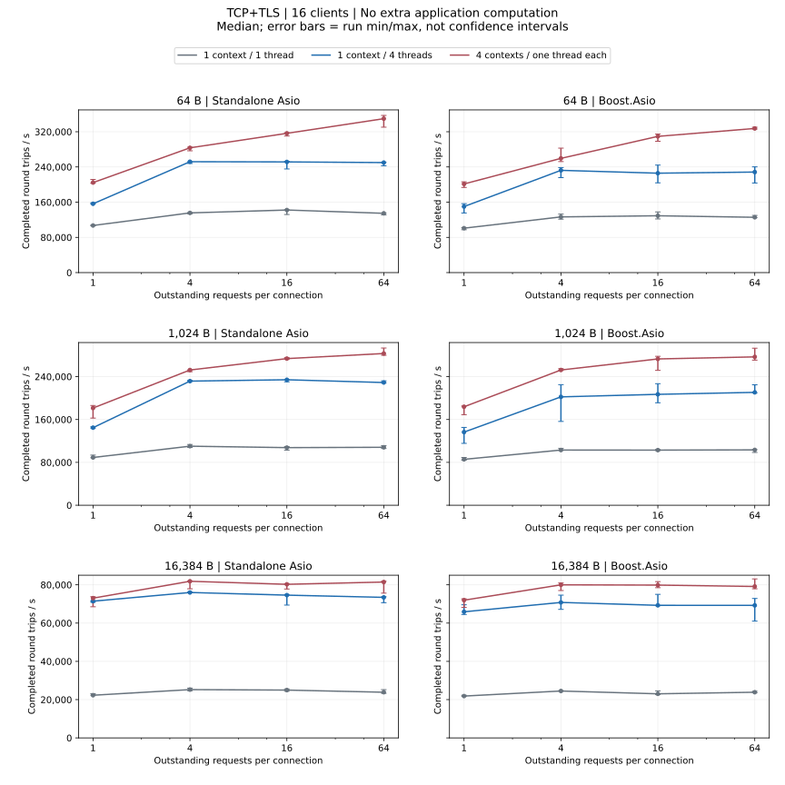
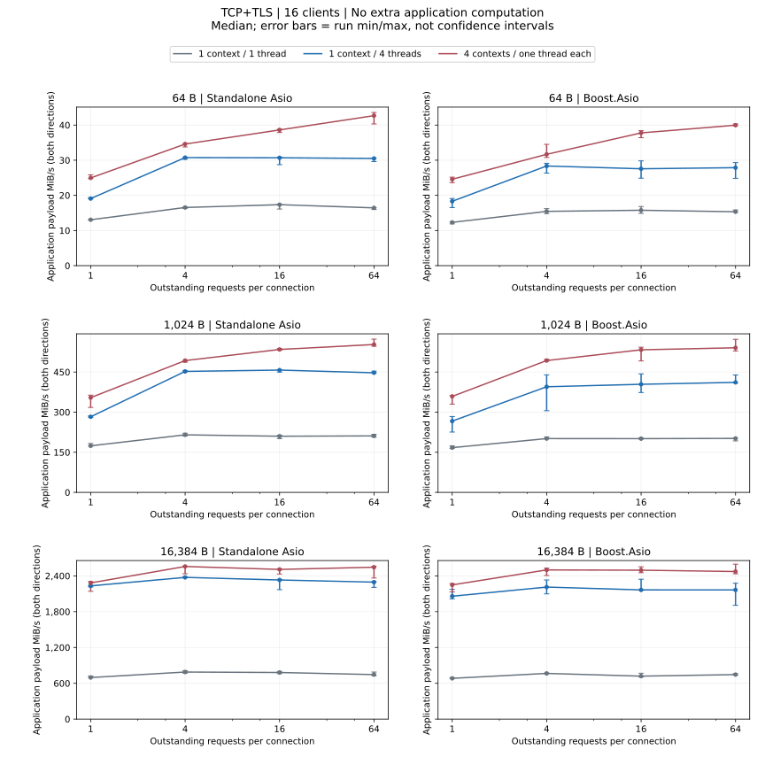
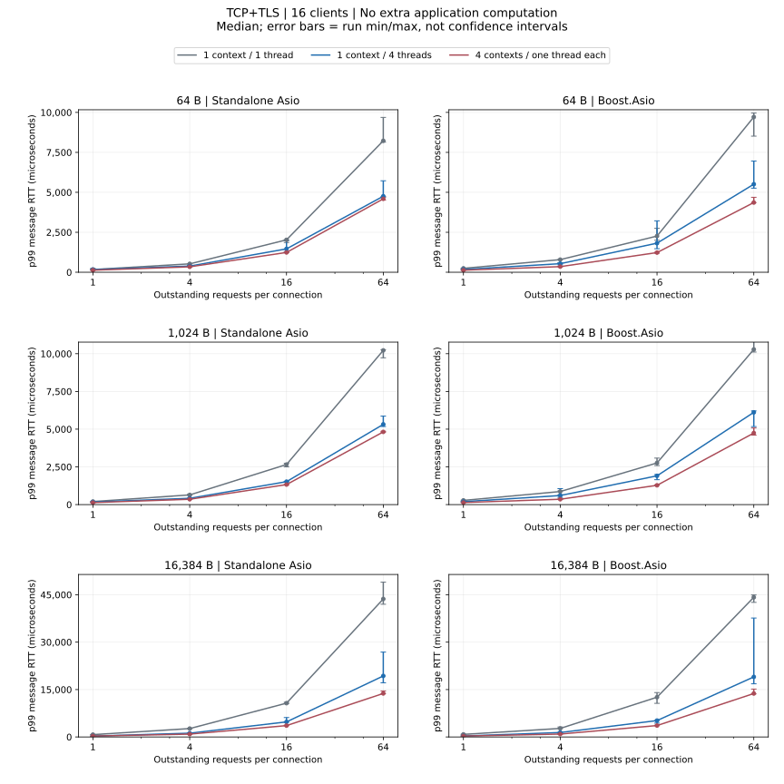

# TCP+TLS Load Comparison

16 clients; 64/1024/16384-byte messages; windows 1/4/16/64; three repetitions per configuration.

## No extra application computation

- Standalone Asio: At 1024 bytes, the highest throughput median uses 4 contexts / one thread each, window 64; the lowest p99 median uses 4 contexts / one thread each, window 1.
- Boost.Asio: At 1024 bytes, the highest throughput median uses 4 contexts / one thread each, window 64; the lowest p99 median uses 4 contexts / one thread each, window 1.

[Complete numeric JSON (p95, run ranges and failures)](dimensions-summary.json ':ignore')

## Failed Profiles

No failed profiles for this protocol.

If any repetition fails, all three measurements for that profile are excluded from rate, latency and matched-ratio summaries; raw failures are retained.

[Metrics, statistics and reproduction](../testing.md)
