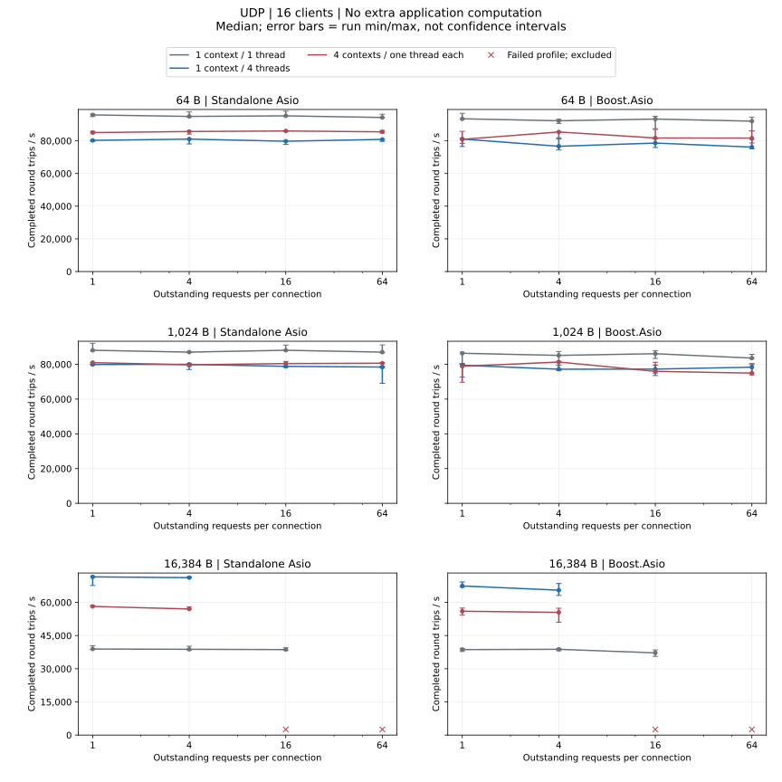
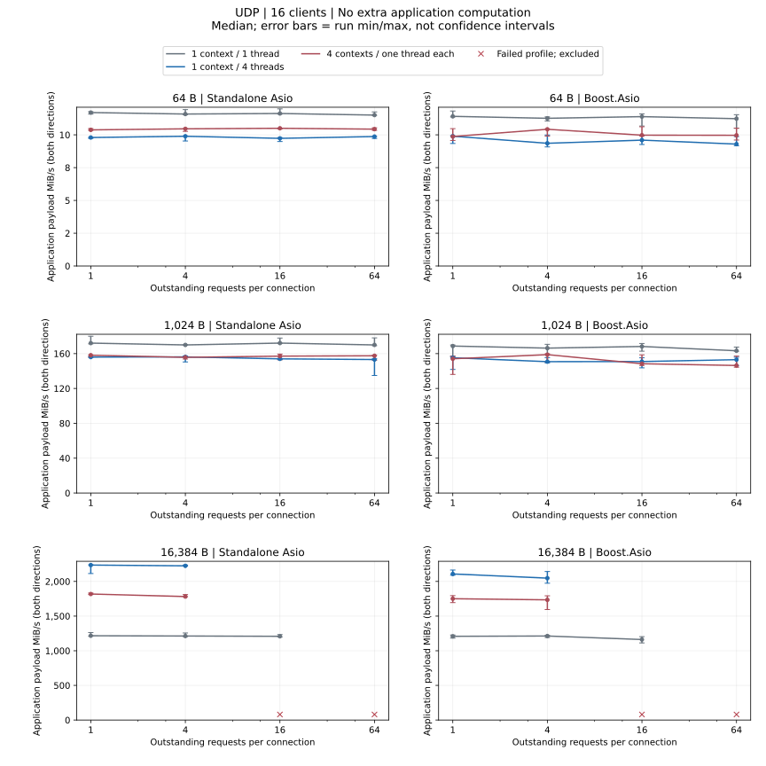
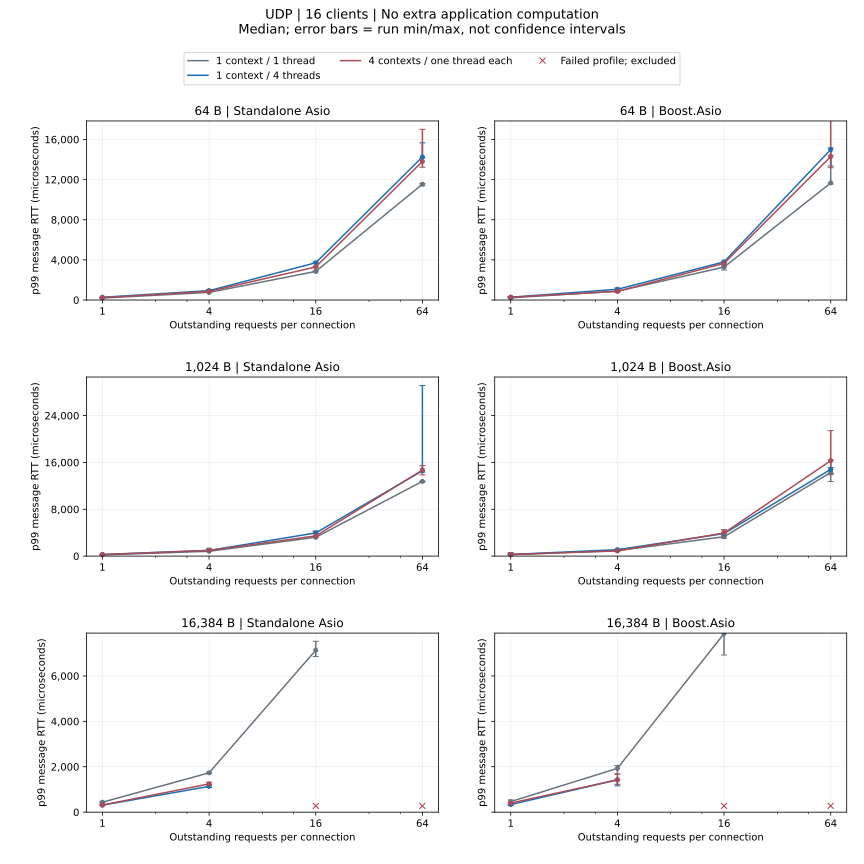

# UDP 负载对比

16 个客户端；消息为 64/1024/16384 字节，窗口为 1/4/16/64；每个配置重复三次。

## 无额外业务计算

- Standalone Asio: 1024 字节时，吞吐量中位数最高为 1 个 io_context / 1 个线程、窗口 16；p99 中位数最低为 1 个 io_context / 1 个线程、窗口 1。
- Boost.Asio: 1024 字节时，吞吐量中位数最高为 1 个 io_context / 1 个线程、窗口 1；p99 中位数最低为 1 个 io_context / 1 个线程、窗口 1。

[完整数值 JSON（含 p95、运行范围与失败记录）](dimensions-summary.json ':ignore')

## 失败配置

| 后端 / 模式 | 消息字节 / 窗口 | 线程模型 | 业务计算 | 失败信息 |
| --- | --- | --- | --- | --- |
| Boost.Asio / 回调 | 16384 / 16 | 4 个 io_context 各 1 个线程 | 无额外业务计算 | #1: benchmark failed with exit code 1; UDP 丢失报文: 1, 等待在途消息完成超时: 1; #2: benchmark failed with exit code 1; UDP 丢失报文: 1, 等待在途消息完成超时: 1; #3: benchmark failed with exit code 1; UDP 丢失报文: 1, 等待在途消息完成超时: 1, 预热错误: 2 |
| Boost.Asio / 回调 | 16384 / 16 | 1 个 io_context / 4 个线程 | 无额外业务计算 | #1: benchmark failed with exit code 1; UDP 丢失报文: 1, 等待在途消息完成超时: 1; #2: benchmark failed with exit code 1; UDP 丢失报文: 1, 等待在途消息完成超时: 1; #3: benchmark failed with exit code 1; UDP 丢失报文: 1, 等待在途消息完成超时: 1, 预热错误: 2 |
| Boost.Asio / 回调 | 16384 / 64 | 4 个 io_context 各 1 个线程 | 无额外业务计算 | #1: benchmark failed with exit code 1; UDP 丢失报文: 769, 等待在途消息完成超时: 1, 预热错误: 769; #2: benchmark failed with exit code 1; UDP 丢失报文: 769, 等待在途消息完成超时: 1, 预热错误: 770; #3: benchmark failed with exit code 1; UDP 丢失报文: 769, 等待在途消息完成超时: 1, 预热错误: 769 |
| Boost.Asio / 回调 | 16384 / 64 | 1 个 io_context / 1 个线程 | 无额外业务计算 | #1: benchmark failed with exit code 1; UDP 丢失报文: 767, 等待在途消息完成超时: 1, 预热错误: 768; #2: benchmark failed with exit code 1; UDP 丢失报文: 767, 等待在途消息完成超时: 1, 预热错误: 768; #3: benchmark failed with exit code 1; UDP 丢失报文: 767, 等待在途消息完成超时: 1, 预热错误: 768 |
| Boost.Asio / 回调 | 16384 / 64 | 1 个 io_context / 4 个线程 | 无额外业务计算 | #1: benchmark failed with exit code 1; UDP 丢失报文: 769, 等待在途消息完成超时: 1, 预热错误: 769; #2: benchmark failed with exit code 1; UDP 丢失报文: 769, 等待在途消息完成超时: 1, 预热错误: 769; #3: benchmark failed with exit code 1; UDP 丢失报文: 769, 等待在途消息完成超时: 1, 预热错误: 770 |
| Standalone Asio / 回调 | 16384 / 16 | 4 个 io_context 各 1 个线程 | 无额外业务计算 | #1: benchmark failed with exit code 1; UDP 丢失报文: 1, 等待在途消息完成超时: 1; #2: benchmark failed with exit code 1; UDP 丢失报文: 1, 等待在途消息完成超时: 1; #3: benchmark failed with exit code 1; UDP 丢失报文: 1, 等待在途消息完成超时: 1 |
| Standalone Asio / 回调 | 16384 / 16 | 1 个 io_context / 4 个线程 | 无额外业务计算 | #1: benchmark failed with exit code 1; UDP 丢失报文: 1, 等待在途消息完成超时: 1; #2: benchmark failed with exit code 1; UDP 丢失报文: 1, 等待在途消息完成超时: 1, 预热错误: 2; #3: benchmark failed with exit code 1; UDP 丢失报文: 1, 等待在途消息完成超时: 1, 预热错误: 2 |
| Standalone Asio / 回调 | 16384 / 64 | 4 个 io_context 各 1 个线程 | 无额外业务计算 | #1: benchmark failed with exit code 1; UDP 丢失报文: 769, 等待在途消息完成超时: 1, 预热错误: 769; #2: benchmark failed with exit code 1; UDP 丢失报文: 769, 等待在途消息完成超时: 1, 预热错误: 769; #3: benchmark failed with exit code 1; UDP 丢失报文: 768, 等待在途消息完成超时: 1, 预热错误: 769 |
| Standalone Asio / 回调 | 16384 / 64 | 1 个 io_context / 1 个线程 | 无额外业务计算 | #1: benchmark failed with exit code 1; UDP 丢失报文: 767, 等待在途消息完成超时: 1, 预热错误: 768; #2: benchmark failed with exit code 1; UDP 丢失报文: 767, 等待在途消息完成超时: 1, 预热错误: 768; #3: benchmark failed with exit code 1; UDP 丢失报文: 767, 等待在途消息完成超时: 1, 预热错误: 768 |
| Standalone Asio / 回调 | 16384 / 64 | 1 个 io_context / 4 个线程 | 无额外业务计算 | #1: benchmark failed with exit code 1; UDP 丢失报文: 769, 等待在途消息完成超时: 1, 预热错误: 769; #2: benchmark failed with exit code 1; UDP 丢失报文: 769, 等待在途消息完成超时: 1, 预热错误: 769; #3: benchmark failed with exit code 1; UDP 丢失报文: 769, 等待在途消息完成超时: 1, 预热错误: 770 |

任一次重复失败，该配置的三次测量均不进入吞吐量、延迟或匹配倍率统计；原始数据保留失败记录。

UDP 窗口增加可能导致丢失；出现丢失的配置属于失败测量，不能作为吞吐能力。服务端仍通过一个 socket 串行接收。

[指标、统计口径与复现](../testing_CN.md)
