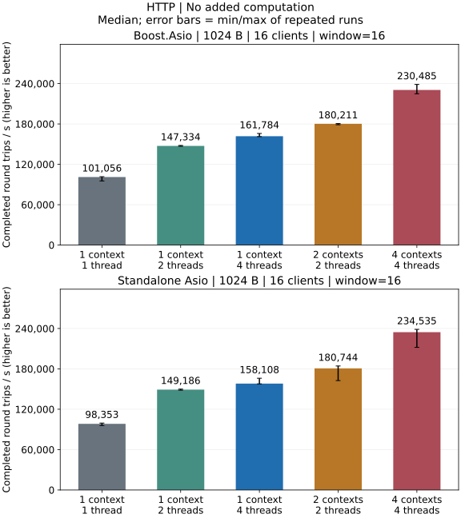
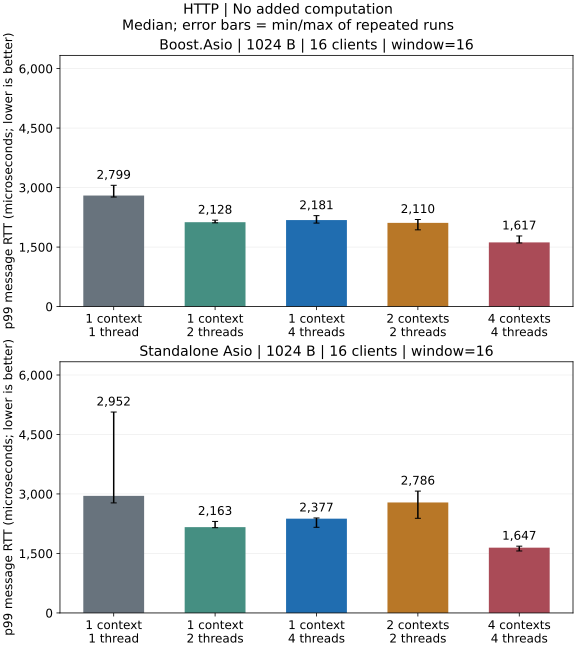

# HTTP 本地性能

数据来自本机 Release 构建的独立回环进程，不来自 CI。

[指标定义与测量方法](../testing_CN.md).

平均进程 CPU 占用率以单核为 100%，多线程可超过 100%；旧样本标为估算，三次 CPU 采样不完整时为 N/A。 本机有 14 个逻辑核心，整机占比 = 进程 CPU% / 14，单核 100% 对应整机 7.14%。

## 无额外业务计算

### 全部测试负载

#### 64 B / 1 客户端 / window=1

| 后端 / 模型 | 往返 / s | MiB/s | p50 / us | p95 / us | p99 / us | CPU / % | RSS / MiB |
| --- | ---: | ---: | ---: | ---: | ---: | ---: | ---: |
| Boost.Asio / 2 个 io_context / 2 个线程 | 20,995 [20,801, 21,074] | 2.56 | 46.88 | 52.79 | 59.25 | 51.2（估算） | 7.77 |
| Boost.Asio / 4 个 io_context / 4 个线程 | 20,962 [20,945, 20,976] | 2.56 | 47.12 | 53.00 | 60.25 | 51.1（估算） | 7.83 |
| Boost.Asio / 1 个 io_context / 1 个线程 | 20,693 [20,583, 20,796] | 2.53 | 47.75 | 54.79 | 62.75 | 42.8（估算） | 7.78 |
| Boost.Asio / 1 个 io_context / 2 个线程 | 31,658 [31,371, 31,725] | 3.86 | 31.12 | 36.17 | 43.25 | 81.1（估算） | 7.80 |
| Boost.Asio / 1 个 io_context / 4 个线程 | 28,762 [28,526, 29,111] | 3.51 | 33.08 | 41.62 | 58.00 | 142.9（估算） | 7.86 |
| Standalone Asio / 2 个 io_context / 2 个线程 | 20,882 [20,775, 21,023] | 2.55 | 47.71 | 53.54 | 61.58 | 51.5（估算） | 8.25 |
| Standalone Asio / 4 个 io_context / 4 个线程 | 20,776 [20,759, 20,865] | 2.54 | 47.62 | 53.08 | 60.54 | 51.3（估算） | 8.30 |
| Standalone Asio / 1 个 io_context / 1 个线程 | 20,587 [20,212, 20,639] | 2.51 | 47.83 | 55.42 | 64.42 | 43.0（估算） | 8.22 |
| Standalone Asio / 1 个 io_context / 2 个线程 | 31,463 [31,352, 31,787] | 3.84 | 31.08 | 37.42 | 50.12 | 81.7（估算） | 8.25 |
| Standalone Asio / 1 个 io_context / 4 个线程 | 28,458 [28,360, 28,715] | 3.47 | 33.38 | 43.46 | 65.96 | 142.5（估算） | 8.30 |

#### 1024 B / 1 客户端 / window=1

| 后端 / 模型 | 往返 / s | MiB/s | p50 / us | p95 / us | p99 / us | CPU / % | RSS / MiB |
| --- | ---: | ---: | ---: | ---: | ---: | ---: | ---: |
| Boost.Asio / 2 个 io_context / 2 个线程 | 13,381 [13,318, 13,393] | 26.13 | 73.08 | 81.75 | 89.92 | 38.6（估算） | 7.75 |
| Boost.Asio / 4 个 io_context / 4 个线程 | 13,412 [13,353, 13,481] | 26.20 | 73.50 | 81.50 | 91.04 | 38.8（估算） | 7.81 |
| Boost.Asio / 1 个 io_context / 1 个线程 | 13,348 [13,299, 13,361] | 26.07 | 73.50 | 82.42 | 91.17 | 34.2（估算） | 7.72 |
| Boost.Asio / 1 个 io_context / 2 个线程 | 34,988 [34,841, 35,004] | 68.34 | 27.54 | 31.83 | 37.79 | 90.9（估算） | 7.78 |
| Boost.Asio / 1 个 io_context / 4 个线程 | 29,079 [28,901, 29,447] | 56.80 | 32.29 | 40.21 | 56.62 | 146.8（估算） | 7.84 |
| Standalone Asio / 2 个 io_context / 2 个线程 | 13,407 [13,271, 13,415] | 26.19 | 73.50 | 81.79 | 91.62 | 38.8（估算） | 8.23 |
| Standalone Asio / 4 个 io_context / 4 个线程 | 13,354 [13,319, 13,398] | 26.08 | 72.92 | 81.96 | 92.29 | 38.7（估算） | 8.27 |
| Standalone Asio / 1 个 io_context / 1 个线程 | 13,246 [12,259, 13,328] | 25.87 | 73.58 | 84.33 | 98.67 | 34.5（估算） | 8.22 |
| Standalone Asio / 1 个 io_context / 2 个线程 | 35,683 [32,269, 35,751] | 69.69 | 27.00 | 31.88 | 40.29 | 91.5（估算） | 8.25 |
| Standalone Asio / 1 个 io_context / 4 个线程 | 29,167 [28,813, 29,650] | 56.97 | 32.00 | 42.42 | 62.21 | 148.8（估算） | 8.33 |

#### 16384 B / 1 客户端 / window=1

| 后端 / 模型 | 往返 / s | MiB/s | p50 / us | p95 / us | p99 / us | CPU / % | RSS / MiB |
| --- | ---: | ---: | ---: | ---: | ---: | ---: | ---: |
| Boost.Asio / 2 个 io_context / 2 个线程 | 2,038 [2,036, 2,081] | 63.68 | 478.21 | 519.04 | 541.12 | 22.6（估算） | 7.78 |
| Boost.Asio / 4 个 io_context / 4 个线程 | 2,012 [2,001, 2,022] | 62.87 | 483.42 | 553.50 | 572.62 | 22.9（估算） | 7.84 |
| Boost.Asio / 1 个 io_context / 1 个线程 | 2,033 [2,016, 2,065] | 63.52 | 478.54 | 530.75 | 560.38 | 21.6（估算） | 7.70 |
| Boost.Asio / 1 个 io_context / 2 个线程 | 16,158 [16,042, 16,388] | 504.92 | 50.04 | 56.83 | 66.21 | 105.1（估算） | 7.81 |
| Boost.Asio / 1 个 io_context / 4 个线程 | 14,924 [14,919, 14,928] | 466.36 | 55.75 | 66.42 | 87.83 | 127.1（估算） | 7.89 |
| Standalone Asio / 2 个 io_context / 2 个线程 | 2,041 [2,015, 2,052] | 63.77 | 472.83 | 542.00 | 564.58 | 22.7（估算） | 8.22 |
| Standalone Asio / 4 个 io_context / 4 个线程 | 2,027 [2,026, 2,062] | 63.35 | 476.50 | 550.17 | 568.75 | 22.8（估算） | 8.31 |
| Standalone Asio / 1 个 io_context / 1 个线程 | 2,026 [1,997, 2,037] | 63.32 | 478.21 | 537.83 | 568.38 | 22.2（估算） | 8.19 |
| Standalone Asio / 1 个 io_context / 2 个线程 | 16,855 [16,187, 17,038] | 526.70 | 47.04 | 56.79 | 74.46 | 105.8（估算） | 8.27 |
| Standalone Asio / 1 个 io_context / 4 个线程 | 15,105 [14,617, 15,436] | 472.03 | 54.29 | 67.46 | 89.88 | 126.5（估算） | 8.38 |

#### 64 B / 16 客户端 / window=16

| 后端 / 模型 | 往返 / s | MiB/s | p50 / us | p95 / us | p99 / us | CPU / % | RSS / MiB |
| --- | ---: | ---: | ---: | ---: | ---: | ---: | ---: |
| Boost.Asio / 2 个 io_context / 2 个线程 | 217,845 [208,717, 225,168] | 26.59 | 1,124.12 | 1,446.08 | 2,244.92 | 198.8（估算） | 8.69 |
| Boost.Asio / 4 个 io_context / 4 个线程 | 285,384 [270,209, 294,985] | 34.84 | 845.04 | 1,288.50 | 1,343.92 | 389.4（估算） | 9.08 |
| Boost.Asio / 1 个 io_context / 1 个线程 | 150,384 [150,297, 151,671] | 18.36 | 1,685.38 | 1,794.71 | 1,864.75 | 99.8（估算） | 8.62 |
| Boost.Asio / 1 个 io_context / 2 个线程 | 182,970 [172,894, 187,171] | 22.34 | 1,356.04 | 1,620.38 | 1,861.00 | 193.8（估算） | 8.61 |
| Boost.Asio / 1 个 io_context / 4 个线程 | 209,663 [207,223, 212,841] | 25.59 | 1,184.83 | 1,504.58 | 1,766.62 | 367.7（估算） | 8.81 |
| Standalone Asio / 2 个 io_context / 2 个线程 | 229,220 [217,599, 236,317] | 27.98 | 1,074.96 | 1,366.29 | 2,174.08 | 199.0（估算） | 9.08 |
| Standalone Asio / 4 个 io_context / 4 个线程 | 284,782 [283,663, 287,910] | 34.76 | 850.96 | 1,281.04 | 1,323.83 | 388.4（估算） | 9.48 |
| Standalone Asio / 1 个 io_context / 1 个线程 | 157,694 [156,776, 157,773] | 19.25 | 1,600.75 | 1,758.67 | 1,943.29 | 99.6（估算） | 9.05 |
| Standalone Asio / 1 个 io_context / 2 个线程 | 191,849 [181,795, 195,437] | 23.42 | 1,307.17 | 1,533.33 | 1,845.04 | 195.2（估算） | 9.09 |
| Standalone Asio / 1 个 io_context / 4 个线程 | 201,333 [169,613, 216,029] | 24.58 | 1,180.79 | 1,738.42 | 2,214.46 | 365.6（估算） | 9.23 |

#### 1024 B / 16 客户端 / window=16

| 后端 / 模型 | 往返 / s | MiB/s | p50 / us | p95 / us | p99 / us | CPU / % | RSS / MiB |
| --- | ---: | ---: | ---: | ---: | ---: | ---: | ---: |
| Boost.Asio / 2 个 io_context / 2 个线程 | 180,211 [178,797, 180,583] | 351.97 | 1,388.33 | 1,565.25 | 2,110.00 | 198.7（估算） | 9.31 |
| Boost.Asio / 4 个 io_context / 4 个线程 | 230,485 [224,878, 238,748] | 450.17 | 1,035.21 | 1,526.50 | 1,616.92 | 385.7（估算） | 9.72 |
| Boost.Asio / 1 个 io_context / 1 个线程 | 101,056 [95,303, 101,646] | 197.37 | 2,559.38 | 2,709.83 | 2,799.08 | 95.1（估算） | 9.30 |
| Boost.Asio / 1 个 io_context / 2 个线程 | 147,334 [146,812, 148,043] | 287.76 | 1,708.54 | 1,929.29 | 2,127.54 | 195.3（估算） | 9.30 |
| Boost.Asio / 1 个 io_context / 4 个线程 | 161,784 [161,158, 165,824] | 315.98 | 1,510.04 | 1,991.67 | 2,180.88 | 368.3（估算） | 9.44 |
| Standalone Asio / 2 个 io_context / 2 个线程 | 180,744 [162,565, 184,333] | 353.01 | 1,361.21 | 1,642.54 | 2,786.17 | 197.6（估算） | 9.77 |
| Standalone Asio / 4 个 io_context / 4 个线程 | 234,535 [211,937, 238,696] | 458.08 | 1,010.50 | 1,500.88 | 1,646.79 | 384.7（估算） | 11.45 |
| Standalone Asio / 1 个 io_context / 1 个线程 | 98,353 [95,808, 99,450] | 192.10 | 2,550.92 | 2,760.71 | 2,951.96 | 88.1（估算） | 9.72 |
| Standalone Asio / 1 个 io_context / 2 个线程 | 149,186 [148,368, 149,892] | 291.38 | 1,674.00 | 1,942.00 | 2,162.96 | 195.1（估算） | 9.78 |
| Standalone Asio / 1 个 io_context / 4 个线程 | 158,108 [157,716, 166,065] | 308.81 | 1,510.58 | 2,068.29 | 2,376.75 | 367.0（估算） | 9.81 |

#### 16384 B / 16 客户端 / window=16

| 后端 / 模型 | 往返 / s | MiB/s | p50 / us | p95 / us | p99 / us | CPU / % | RSS / MiB |
| --- | ---: | ---: | ---: | ---: | ---: | ---: | ---: |
| Boost.Asio / 2 个 io_context / 2 个线程 | 32,430 [32,127, 32,622] | 1,013.44 | 7,787.88 | 8,518.17 | 8,843.83 | 146.0（估算） | 20.45 |
| Boost.Asio / 4 个 io_context / 4 个线程 | 39,021 [38,133, 39,200] | 1,219.40 | 6,484.25 | 6,962.62 | 7,363.12 | 241.6（估算） | 20.61 |
| Boost.Asio / 1 个 io_context / 1 个线程 | 18,309 [18,257, 18,410] | 572.17 | 13,937.88 | 14,193.54 | 14,276.83 | 83.7（估算） | 20.36 |
| Boost.Asio / 1 个 io_context / 2 个线程 | 37,626 [36,596, 37,719] | 1,175.82 | 6,760.71 | 7,335.50 | 7,788.46 | 190.2（估算） | 20.41 |
| Boost.Asio / 1 个 io_context / 4 个线程 | 42,983 [42,951, 43,408] | 1,343.21 | 5,728.08 | 6,695.92 | 6,923.58 | 369.2（估算） | 20.55 |
| Standalone Asio / 2 个 io_context / 2 个线程 | 32,485 [31,627, 34,492] | 1,015.16 | 7,881.21 | 8,252.71 | 8,569.42 | 143.7（估算） | 20.86 |
| Standalone Asio / 4 个 io_context / 4 个线程 | 39,319 [39,229, 39,451] | 1,228.72 | 6,447.25 | 6,929.83 | 7,159.83 | 240.0（估算） | 20.88 |
| Standalone Asio / 1 个 io_context / 1 个线程 | 18,870 [17,573, 18,997] | 589.68 | 13,520.17 | 14,473.50 | 15,043.92 | 83.0（估算） | 20.80 |
| Standalone Asio / 1 个 io_context / 2 个线程 | 38,472 [36,113, 38,709] | 1,202.25 | 6,612.17 | 7,079.25 | 7,517.17 | 189.9（估算） | 20.77 |
| Standalone Asio / 1 个 io_context / 4 个线程 | 43,545 [42,816, 44,201] | 1,360.80 | 5,738.17 | 6,652.54 | 7,347.25 | 369.8（估算） | 20.86 |

表格记录重复运行的中位数，吞吐量方括号为最小值和最大值；误差范围不是置信区间。延迟取各次采样分位数的中位数，不合并样本。
