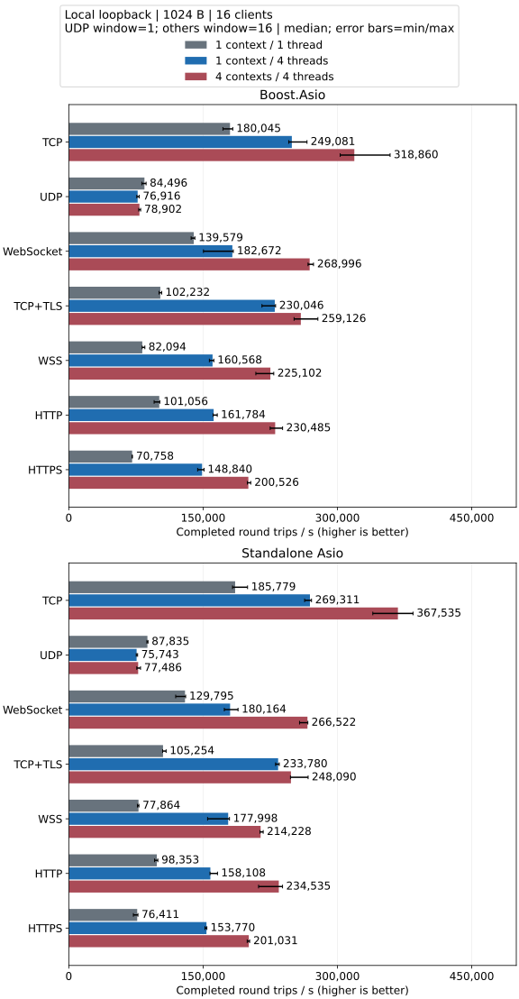
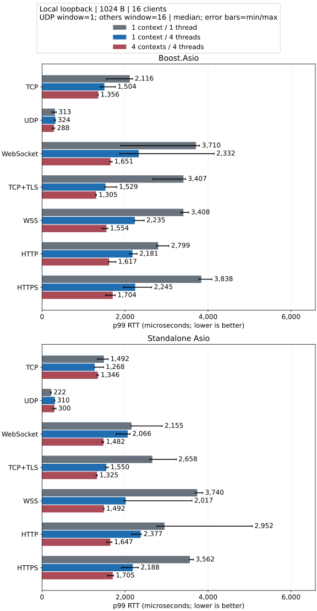

# 本地性能报告

本机完成 **1,620 次 IPv4 测量**，比较 Asio 后端配置下的吞吐量、p99 延迟和 IO 模型。

## 测试条件

| 配置 | 实测机器 |
| --- | --- |
| 机器型号 | Mac16,11 |
| 处理器 | Apple M4 Pro |
| 架构 | arm64 |
| 物理 / 逻辑核心 | 14 / 14 |
| 内存 | 48 GiB |
| 操作系统 | macOS 27.0.1 (26A434) |
| 内核版本 | 27.0.0 |

Release 构建；测量 1.0 s，预热 0.25 s，重复 3 次。

主图：**1024 字节、16 个客户端、无额外业务计算**；每连接在途消息上限为 UDP 1 条、其他协议 16 条。客户端与服务端在同一进程内共享 IO 线程，使用本机回环网络。

平均进程 CPU 占用率以单核为 100%，多线程可超过 100%；旧样本标为估算，三次 CPU 采样不完整时为 N/A。 本机有 14 个逻辑核心，整机占比 = 进程 CPU% / 14，单核 100% 对应整机 7.14%。

## 核心结果

- **TCP / Standalone Asio / 无额外业务计算**：本组吞吐量最高的模型为 4 个 io_context / 4 个线程，相对单线程为 1.98×；对应 p99 为 1,346.00 us，单线程为 1,491.79 us。
- **UDP / Standalone Asio / 无额外业务计算**：本组吞吐量最高的模型为 1 个 io_context / 2 个线程，相对单线程为 1.06×；对应 p99 为 210.92 us，单线程为 221.50 us。
- **协程 TCP / Standalone Asio / 无额外业务计算**：本组吞吐量最高的模型为 1 个 io_context / 4 个线程，相对单线程为 1.84×；对应 p99 为 870.46 us，单线程为 1,028.71 us。
- **协程 TCP / Standalone Asio / 每次回显执行 10,000 次 CPU 计算**：本组吞吐量最高的模型为 4 个 io_context / 4 个线程，相对单线程为 3.54×；对应 p99 为 1,749.29 us，单线程为 5,687.25 us。

最高中位数仅适用于对应负载；完整数据见下表。

## 吞吐量

## p99 往返延迟

99% 的采样往返在该时间内完成；1000 微秒 = 1 毫秒。

## 如何选择 IO 模型

| 模型 | 对应业务 | 需要注意 |
| --- | --- | --- |
| 1 个 io_context / 1 个线程 | 低并发、控制服务、较轻的状态处理 | 耗时回调会影响所有连接 |
| 1 个 io_context / 多线程 | 连接活跃程度不均衡、希望共享空闲线程 | 使用每连接 strand；共享调度有开销 |
| 多个 io_context / 各 1 个线程 | 分区会话、租户或负载分配稳定的服务 | 繁忙分片无法借用其他分片线程 |

[协程的 IO 与 CPU 负载比较](../threading_CN.md).

## 各协议的详细结果

- [TCP](./tcp_CN.md)
- [UDP](./udp_CN.md)
- [WebSocket](./websocket_CN.md)
- [TCP+TLS](./tcps_CN.md)
- [WSS](./wss_CN.md)
- [HTTP](./http_CN.md)
- [HTTPS](./https_CN.md)
- [协程 TCP](./coroutine_CN.md)

详细页包含 64/1024/16384 字节、1/16 个客户端的全部数据。柱子为重复运行的中位数；误差线为最小／最大值，不是置信区间。

[全部数值（JSON）](summary.json ':ignore') | [包体、批量与执行方式对比](dimensions_CN.md)

协程 window=16 测量整批 RTT，回调测试程序测量逐消息 RTT；不能据此判断协程加速比。

## 工具链与构建

Apple Clang 21.0.0; CMake 4.3.3; Ninja; Release -O3 -DNDEBUG -std=gnu++20 -arch arm64; TLS ON; sanitizers OFF. Standalone Asio 1.38.2 with BHO Beast based on Boost 1.84 (API 351); Boost 1.90.0 with Asio 1.38.0 and Beast API 359; OpenSSL 3.6.4. Mac mini on AC power, low power mode disabled, no CPU affinity.

两种后端使用的 Beast 版本不同，后端之间的性能差异同时包含依赖版本的影响，不能全部归因于 Asio。

## 指标定义

[吞吐量、RTT、CPU、RSS 和错误定义](../testing_CN.md).

## 原始数据与复现

- Source SHA-256: `127a500ad7e2fbe4c831cc3ebacc63acac96013e2cb8bf3893d7997ca6ea7f56`
- [已完成测量]: 1620
- [复现命令与检查范围](../testing_CN.md)

- [macmini-m4pro-20261010-boost-coroutine.json](https://github.com/OpenArkStudio/arknet/blob/main/benchmarks/results/macmini-m4pro-20261010-boost-coroutine.json): 180 measurements; 2026-10-10T06:22:06.443606+00:00; executable SHA-256 `14b22c5832f3d7731294a735d97ab5464cbf64c4efeb439f8f5f4b7576c70df4`
- [macmini-m4pro-20261010-boost-http.json](https://github.com/OpenArkStudio/arknet/blob/main/benchmarks/results/macmini-m4pro-20261010-boost-http.json): 90 measurements; 2026-10-10T06:08:56.779694+00:00; executable SHA-256 `7b2989fd23e15a68a662899d1906f3b094138018b8ada5904309b4a90d96ea34`
- [macmini-m4pro-20261010-boost-https.json](https://github.com/OpenArkStudio/arknet/blob/main/benchmarks/results/macmini-m4pro-20261010-boost-https.json): 90 measurements; 2026-10-10T06:16:12.072913+00:00; executable SHA-256 `7b2989fd23e15a68a662899d1906f3b094138018b8ada5904309b4a90d96ea34`
- [macmini-m4pro-20261010-boost-tcp.json](https://github.com/OpenArkStudio/arknet/blob/main/benchmarks/results/macmini-m4pro-20261010-boost-tcp.json): 90 measurements; 2026-10-10T05:31:57.122216+00:00; executable SHA-256 `7b2989fd23e15a68a662899d1906f3b094138018b8ada5904309b4a90d96ea34`
- [macmini-m4pro-20261010-boost-tcps.json](https://github.com/OpenArkStudio/arknet/blob/main/benchmarks/results/macmini-m4pro-20261010-boost-tcps.json): 90 measurements; 2026-10-10T05:56:20.110867+00:00; executable SHA-256 `7b2989fd23e15a68a662899d1906f3b094138018b8ada5904309b4a90d96ea34`
- [macmini-m4pro-20261010-boost-udp.json](https://github.com/OpenArkStudio/arknet/blob/main/benchmarks/results/macmini-m4pro-20261010-boost-udp.json): 90 measurements; 2026-10-10T05:38:07.209143+00:00; executable SHA-256 `7b2989fd23e15a68a662899d1906f3b094138018b8ada5904309b4a90d96ea34`
- [macmini-m4pro-20261010-boost-websocket.json](https://github.com/OpenArkStudio/arknet/blob/main/benchmarks/results/macmini-m4pro-20261010-boost-websocket.json): 90 measurements; 2026-10-10T05:44:16.816290+00:00; executable SHA-256 `7b2989fd23e15a68a662899d1906f3b094138018b8ada5904309b4a90d96ea34`
- [macmini-m4pro-20261010-boost-wss.json](https://github.com/OpenArkStudio/arknet/blob/main/benchmarks/results/macmini-m4pro-20261010-boost-wss.json): 90 measurements; 2026-10-10T06:02:39.046046+00:00; executable SHA-256 `7b2989fd23e15a68a662899d1906f3b094138018b8ada5904309b4a90d96ea34`
- [macmini-m4pro-20261010-standalone-coroutine.json](https://github.com/OpenArkStudio/arknet/blob/main/benchmarks/results/macmini-m4pro-20261010-standalone-coroutine.json): 180 measurements; 2026-10-10T06:18:15.349061+00:00; executable SHA-256 `f2878cefe4ec4259114a9492fa7ac2235deecf797be63735ae51668d7a25b73f`
- [macmini-m4pro-20261010-standalone-http.json](https://github.com/OpenArkStudio/arknet/blob/main/benchmarks/results/macmini-m4pro-20261010-standalone-http.json): 90 measurements; 2026-10-10T06:06:57.385745+00:00; executable SHA-256 `480122707b4b3ed592d1f580f5cf7092b8008ce52331f55f0e666e89c568be6b`
- [macmini-m4pro-20261010-standalone-https.json](https://github.com/OpenArkStudio/arknet/blob/main/benchmarks/results/macmini-m4pro-20261010-standalone-https.json): 90 measurements; 2026-10-10T06:14:08.452400+00:00; executable SHA-256 `480122707b4b3ed592d1f580f5cf7092b8008ce52331f55f0e666e89c568be6b`
- [macmini-m4pro-20261010-standalone-tcp.json](https://github.com/OpenArkStudio/arknet/blob/main/benchmarks/results/macmini-m4pro-20261010-standalone-tcp.json): 90 measurements; 2026-10-10T05:29:56.838785+00:00; executable SHA-256 `480122707b4b3ed592d1f580f5cf7092b8008ce52331f55f0e666e89c568be6b`
- [macmini-m4pro-20261010-standalone-tcps.json](https://github.com/OpenArkStudio/arknet/blob/main/benchmarks/results/macmini-m4pro-20261010-standalone-tcps.json): 90 measurements; 2026-10-10T05:54:16.794729+00:00; executable SHA-256 `480122707b4b3ed592d1f580f5cf7092b8008ce52331f55f0e666e89c568be6b`
- [macmini-m4pro-20261010-standalone-udp.json](https://github.com/OpenArkStudio/arknet/blob/main/benchmarks/results/macmini-m4pro-20261010-standalone-udp.json): 90 measurements; 2026-10-10T05:36:07.408981+00:00; executable SHA-256 `480122707b4b3ed592d1f580f5cf7092b8008ce52331f55f0e666e89c568be6b`
- [macmini-m4pro-20261010-standalone-websocket.json](https://github.com/OpenArkStudio/arknet/blob/main/benchmarks/results/macmini-m4pro-20261010-standalone-websocket.json): 90 measurements; 2026-10-10T05:42:15.113877+00:00; executable SHA-256 `480122707b4b3ed592d1f580f5cf7092b8008ce52331f55f0e666e89c568be6b`
- [macmini-m4pro-20261010-standalone-wss.json](https://github.com/OpenArkStudio/arknet/blob/main/benchmarks/results/macmini-m4pro-20261010-standalone-wss.json): 90 measurements; 2026-10-10T06:00:34.943293+00:00; executable SHA-256 `480122707b4b3ed592d1f580f5cf7092b8008ce52331f55f0e666e89c568be6b`

## 适用范围

本机回环结果不代表跨主机或生产容量。短时测量、调度和温度可能带来波动；部署前需按实际负载复测。
