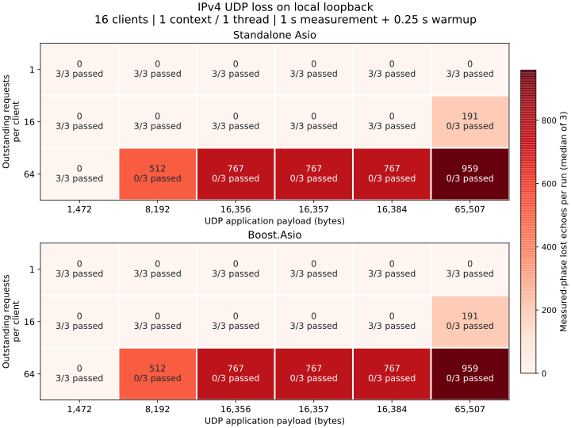

# UDP Datagram Size and Burst Loss

Release IPv4 loopback on the Mac mini M4 Pro: 16 clients, one context/one
thread, no extra computation, 1 s measurement and 0.25 s warmup. Each backend
runs six payloads × three windows × three repetitions: **36 pass, 18 fail**.



Cells show measured-phase lost echoes per run. All three repetitions have
identical loss counts, and both backends match. Warmup errors remain in the
raw JSON; failed configurations are excluded from throughput comparisons.

- Every payload passes at window 1, including **65,507 bytes**. The 1,472-byte
  payload also passes at windows 16 and 64.
- At window 64, 8,192-byte messages lose 512 echoes per run;
  16,356/16,357/16,384-byte messages each lose 767. The 65,507-byte payload
  loses 191 at window 16 and 959 at window 64.

## Payload and MTU Limits

| Ordinary UDP payload | IPv4 | IPv6 |
| --- | ---: | ---: |
| Protocol maximum | 65,507 = 65,535 − 20 − 8 | 65,527 = 65,535 − 8 |
| Without fragmentation at MTU 1,500 | 1,472 = 1,500 − 20 − 8 | 1,452 = 1,500 − 40 − 8 |
| Mathematical budget at MTU 16,384 | 16,356 | 16,336 |

These calculations assume a 20-byte IPv4 header or a 40-byte IPv6 base
header and an 8-byte UDP header. IP options or extension headers reduce the
budget; IPv6 jumbograms are outside this table. IPv6 routers do not fragment
packets. These diagnostics use IPv4 only and do not establish IPv6 limits
under load.

`lo0` has MTU 16,384, but its IPv4 fragmentation/reassembly counters stayed
at zero even when larger datagrams succeeded. The mathematical MTU boundary
is not an observed fragmentation threshold on this loopback path. Cross-host
payload sizing must use the actual path MTU.

## Kernel Evidence

| Backend | Full socket buffers before → after | Increase | IPv4 fragmentation / reassembly increase |
| --- | ---: | ---: | ---: |
| Standalone Asio | 27,666 → 51,444 | 23,778 | 0 / 0 |
| Boost.Asio | 51,444 → 75,222 | 23,778 | 0 / 0 |

Each backend records 11,889 lost echoes in the measurement phase. The kernel
counts cover the whole stage, including warmup, and are system-wide. They
record receive-buffer overflow during the bursts; there is no recorded IPv4
fragmentation supporting fragmentation as the explanation for these losses.
Send admission/completion and content errors are all zero.

The configured sockets report **64 KiB send / 4 MiB receive** buffers.
`net.inet.udp.maxdgram=9216` and `net.inet.udp.recvspace=786896` stayed unchanged;
65,507-byte successful echoes show that 9,216 was not an effective payload
ceiling for these configured sockets. Window 16 passes at 16 KiB, while
window 64 overflows buffers: datagram validity and burst capacity are separate.

## Reproduce

Compile using [UDP build instructions](../udp/performance.md#build-and-run),
then run an independent C++ case:

```sh
build-perf/benchmarks/arknet_loopback_benchmark \
  --protocol udp --payload 65507 --clients 16 --window 1 \
  --io-model shared --io-threads 1 --work 0 --warmup 0.25 --seconds 1
```

The archived [Standalone command and kernel snapshots](https://github.com/OpenArkStudio/arknet/tree/main/benchmarks/results/macmini-m4pro-20261010-udp-limits)
also retain the complete shell matrix and the Boost command. The optional
offline chart tool needs the [report environment](../testing.md#metrics-and-charts):

```sh
build/report-venv/bin/python scripts/udp_limits_report.py \
  --input-dir benchmarks/results/macmini-m4pro-20261010-udp-limits \
  --output docs/performance/assets/udp-limits-loss.svg
```

Report-tool checks validate the archived cohort and reject malformed data;
they do not launch network tests:

```sh
python3 -m unittest discover -s scripts -p 'test_udp_limits_report.py' -v
```

[Standalone raw JSON](https://raw.githubusercontent.com/OpenArkStudio/arknet/main/benchmarks/results/macmini-m4pro-20261010-udp-limits/standalone.json) ·
[Boost raw JSON](https://raw.githubusercontent.com/OpenArkStudio/arknet/main/benchmarks/results/macmini-m4pro-20261010-udp-limits/boost.json) ·
[Numeric chart data](assets/udp-limits-loss.json ':ignore') ·
[Environment and measurement definitions](../testing.md)

Source SHA-256: `fa69d6ce97745281290a263cb0f2515470ede0edb77f5132ce6e3ac7ae7cd9b4`.
