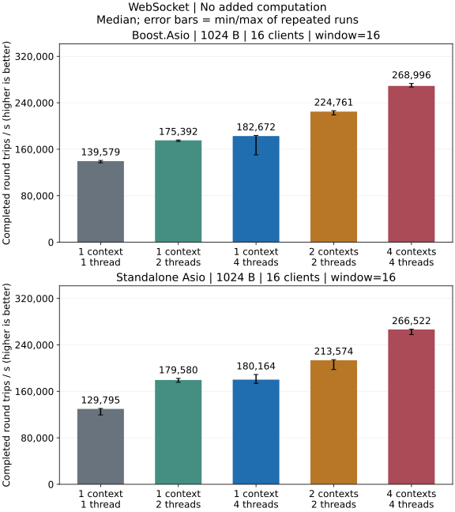
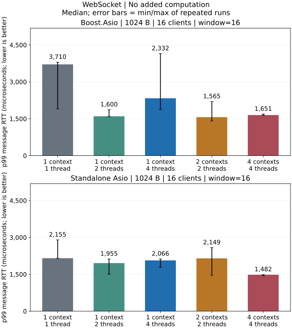

# WebSocket 本地性能

数据来自本机 Release 构建的独立回环进程，不来自 CI。

[指标定义与测量方法](../testing_CN.md).

平均进程 CPU 占用率以单核为 100%，多线程可超过 100%；旧样本标为估算，三次 CPU 采样不完整时为 N/A。 本机有 14 个逻辑核心，整机占比 = 进程 CPU% / 14，单核 100% 对应整机 7.14%。

## 无额外业务计算

### 全部测试负载

#### 64 B / 1 客户端 / window=1

| 后端 / 模型 | 往返 / s | MiB/s | p50 / us | p95 / us | p99 / us | CPU / % | RSS / MiB |
| --- | ---: | ---: | ---: | ---: | ---: | ---: | ---: |
| Boost.Asio / 2 个 io_context / 2 个线程 | 55,126 [55,056, 55,194] | 6.73 | 17.71 | 21.50 | 24.17 | 90.4（估算） | 8.11 |
| Boost.Asio / 4 个 io_context / 4 个线程 | 55,216 [54,747, 55,226] | 6.74 | 17.62 | 21.38 | 24.04 | 90.4（估算） | 8.19 |
| Boost.Asio / 1 个 io_context / 1 个线程 | 63,238 [61,013, 64,632] | 7.72 | 15.21 | 22.12 | 24.96 | 83.7（估算） | 8.14 |
| Boost.Asio / 1 个 io_context / 2 个线程 | 53,370 [53,069, 53,549] | 6.51 | 18.17 | 23.62 | 26.58 | 119.1（估算） | 8.09 |
| Boost.Asio / 1 个 io_context / 4 个线程 | 39,796 [38,699, 39,905] | 4.86 | 24.21 | 30.42 | 40.71 | 179.4（估算） | 8.19 |
| Standalone Asio / 2 个 io_context / 2 个线程 | 60,649 [60,466, 61,384] | 7.40 | 15.75 | 19.96 | 23.25 | 95.4（估算） | 8.56 |
| Standalone Asio / 4 个 io_context / 4 个线程 | 60,475 [59,801, 60,737] | 7.38 | 15.88 | 20.08 | 23.92 | 94.7（估算） | 8.62 |
| Standalone Asio / 1 个 io_context / 1 个线程 | 54,636 [54,173, 56,364] | 6.67 | 19.00 | 22.62 | 26.04 | 81.6（估算） | 8.50 |
| Standalone Asio / 1 个 io_context / 2 个线程 | 53,958 [51,610, 54,192] | 6.59 | 18.42 | 24.04 | 28.12 | 122.5（估算） | 8.56 |
| Standalone Asio / 1 个 io_context / 4 个线程 | 41,051 [40,568, 41,467] | 5.01 | 23.42 | 28.92 | 35.04 | 170.7（估算） | 8.62 |

#### 1024 B / 1 客户端 / window=1

| 后端 / 模型 | 往返 / s | MiB/s | p50 / us | p95 / us | p99 / us | CPU / % | RSS / MiB |
| --- | ---: | ---: | ---: | ---: | ---: | ---: | ---: |
| Boost.Asio / 2 个 io_context / 2 个线程 | 52,242 [52,030, 52,750] | 102.04 | 18.17 | 21.42 | 24.79 | 91.7（估算） | 8.14 |
| Boost.Asio / 4 个 io_context / 4 个线程 | 52,476 [51,990, 52,496] | 102.49 | 18.12 | 21.33 | 24.58 | 91.8（估算） | 8.19 |
| Boost.Asio / 1 个 io_context / 1 个线程 | 50,723 [49,368, 50,839] | 99.07 | 18.96 | 22.38 | 25.21 | 82.8（估算） | 8.12 |
| Boost.Asio / 1 个 io_context / 2 个线程 | 48,862 [47,850, 48,990] | 95.43 | 19.29 | 24.42 | 28.29 | 117.8（估算） | 8.12 |
| Boost.Asio / 1 个 io_context / 4 个线程 | 38,873 [38,628, 40,189] | 75.92 | 24.29 | 30.29 | 39.17 | 173.4（估算） | 8.20 |
| Standalone Asio / 2 个 io_context / 2 个线程 | 56,523 [56,155, 56,742] | 110.40 | 16.38 | 20.29 | 23.42 | 94.0（估算） | 8.59 |
| Standalone Asio / 4 个 io_context / 4 个线程 | 56,593 [56,030, 57,153] | 110.53 | 16.29 | 20.42 | 23.21 | 94.3（估算） | 8.69 |
| Standalone Asio / 1 个 io_context / 1 个线程 | 50,735 [50,001, 50,779] | 99.09 | 18.88 | 22.21 | 25.42 | 83.3（估算） | 8.55 |
| Standalone Asio / 1 个 io_context / 2 个线程 | 48,718 [48,413, 48,820] | 95.15 | 19.29 | 24.12 | 27.12 | 119.3（估算） | 8.58 |
| Standalone Asio / 1 个 io_context / 4 个线程 | 38,570 [36,598, 39,183] | 75.33 | 24.33 | 30.54 | 41.42 | 163.7（估算） | 8.64 |

#### 16384 B / 1 客户端 / window=1

| 后端 / 模型 | 往返 / s | MiB/s | p50 / us | p95 / us | p99 / us | CPU / % | RSS / MiB |
| --- | ---: | ---: | ---: | ---: | ---: | ---: | ---: |
| Boost.Asio / 2 个 io_context / 2 个线程 | 6,915 [6,800, 6,967] | 216.10 | 129.29 | 157.58 | 170.96 | 64.4（估算） | 8.20 |
| Boost.Asio / 4 个 io_context / 4 个线程 | 6,858 [6,828, 6,955] | 214.31 | 130.88 | 160.00 | 174.25 | 64.5（估算） | 8.30 |
| Boost.Asio / 1 个 io_context / 1 个线程 | 8,401 [8,146, 8,492] | 262.53 | 103.71 | 129.83 | 140.62 | 56.7（估算） | 8.19 |
| Boost.Asio / 1 个 io_context / 2 个线程 | 16,035 [15,934, 16,111] | 501.11 | 52.29 | 59.00 | 64.42 | 147.1（估算） | 8.20 |
| Boost.Asio / 1 个 io_context / 4 个线程 | 10,645 [10,644, 11,023] | 332.67 | 80.42 | 102.62 | 134.62 | 217.5（估算） | 8.36 |
| Standalone Asio / 2 个 io_context / 2 个线程 | 6,480 [6,431, 6,508] | 202.51 | 142.29 | 164.21 | 174.62 | 66.4（估算） | 8.66 |
| Standalone Asio / 4 个 io_context / 4 个线程 | 6,547 [6,308, 6,573] | 204.58 | 141.04 | 163.62 | 170.62 | 66.4（估算） | 8.70 |
| Standalone Asio / 1 个 io_context / 1 个线程 | 7,870 [7,804, 7,968] | 245.95 | 113.17 | 134.04 | 157.88 | 56.9（估算） | 8.64 |
| Standalone Asio / 1 个 io_context / 2 个线程 | 15,490 [15,064, 15,502] | 484.06 | 53.96 | 62.38 | 73.12 | 147.8（估算） | 8.64 |
| Standalone Asio / 1 个 io_context / 4 个线程 | 11,279 [10,720, 11,298] | 352.47 | 76.00 | 92.62 | 125.62 | 214.0（估算） | 8.81 |

#### 64 B / 16 客户端 / window=16

| 后端 / 模型 | 往返 / s | MiB/s | p50 / us | p95 / us | p99 / us | CPU / % | RSS / MiB |
| --- | ---: | ---: | ---: | ---: | ---: | ---: | ---: |
| Boost.Asio / 2 个 io_context / 2 个线程 | 269,499 [263,627, 274,023] | 32.90 | 967.25 | 1,313.62 | 1,459.50 | 198.8（估算） | 9.23 |
| Boost.Asio / 4 个 io_context / 4 个线程 | 296,503 [294,559, 303,759] | 36.19 | 766.08 | 1,329.46 | 1,678.58 | 381.2（估算） | 9.38 |
| Boost.Asio / 1 个 io_context / 1 个线程 | 160,506 [156,591, 163,807] | 19.59 | 1,574.38 | 1,753.21 | 2,383.75 | 97.5（估算） | 9.09 |
| Boost.Asio / 1 个 io_context / 2 个线程 | 207,659 [205,752, 208,640] | 25.35 | 1,227.00 | 1,341.25 | 1,466.29 | 192.5（估算） | 9.20 |
| Boost.Asio / 1 个 io_context / 4 个线程 | 217,362 [215,987, 217,802] | 26.53 | 1,184.42 | 1,355.00 | 1,680.54 | 359.3（估算） | 9.38 |
| Standalone Asio / 2 个 io_context / 2 个线程 | 282,115 [281,053, 289,321] | 34.44 | 877.46 | 945.62 | 1,509.25 | 198.9（估算） | 9.56 |
| Standalone Asio / 4 个 io_context / 4 个线程 | 325,744 [304,374, 347,721] | 39.76 | 764.67 | 1,221.83 | 1,273.25 | 387.9（估算） | 9.89 |
| Standalone Asio / 1 个 io_context / 1 个线程 | 156,037 [145,957, 157,850] | 19.05 | 1,618.08 | 1,688.21 | 1,758.46 | 99.6（估算） | 9.64 |
| Standalone Asio / 1 个 io_context / 2 个线程 | 229,468 [228,751, 231,406] | 28.01 | 1,096.17 | 1,167.21 | 1,355.46 | 197.8（估算） | 9.58 |
| Standalone Asio / 1 个 io_context / 4 个线程 | 256,714 [254,044, 259,312] | 31.34 | 955.46 | 1,175.71 | 1,538.88 | 382.8（估算） | 9.73 |

#### 1024 B / 16 客户端 / window=16

| 后端 / 模型 | 往返 / s | MiB/s | p50 / us | p95 / us | p99 / us | CPU / % | RSS / MiB |
| --- | ---: | ---: | ---: | ---: | ---: | ---: | ---: |
| Boost.Asio / 2 个 io_context / 2 个线程 | 224,761 [219,029, 226,371] | 438.99 | 1,124.25 | 1,283.38 | 1,564.71 | 199.1（估算） | 9.80 |
| Boost.Asio / 4 个 io_context / 4 个线程 | 268,996 [267,176, 273,267] | 525.38 | 870.50 | 1,471.25 | 1,650.83 | 381.0（估算） | 9.94 |
| Boost.Asio / 1 个 io_context / 1 个线程 | 139,579 [136,624, 140,775] | 272.62 | 1,736.88 | 2,895.75 | 3,709.92 | 97.6（估算） | 9.75 |
| Boost.Asio / 1 个 io_context / 2 个线程 | 175,392 [173,541, 175,970] | 342.56 | 1,448.08 | 1,533.83 | 1,599.67 | 192.6（估算） | 9.88 |
| Boost.Asio / 1 个 io_context / 4 个线程 | 182,672 [150,381, 183,738] | 356.78 | 1,365.08 | 1,679.17 | 2,332.17 | 358.2（估算） | 9.94 |
| Standalone Asio / 2 个 io_context / 2 个线程 | 213,574 [197,498, 214,573] | 417.14 | 1,180.04 | 1,296.92 | 2,148.62 | 199.0（估算） | 10.20 |
| Standalone Asio / 4 个 io_context / 4 个线程 | 266,522 [257,696, 266,948] | 520.55 | 901.83 | 1,423.12 | 1,482.04 | 387.2（估算） | 10.47 |
| Standalone Asio / 1 个 io_context / 1 个线程 | 129,795 [119,376, 130,507] | 253.51 | 1,961.25 | 2,069.79 | 2,155.08 | 99.5（估算） | 10.20 |
| Standalone Asio / 1 个 io_context / 2 个线程 | 179,580 [175,593, 182,302] | 350.74 | 1,407.38 | 1,532.08 | 1,955.33 | 196.9（估算） | 10.28 |
| Standalone Asio / 1 个 io_context / 4 个线程 | 180,164 [173,686, 188,995] | 351.88 | 1,357.50 | 1,851.79 | 2,066.25 | 375.9（估算） | 10.34 |

#### 16384 B / 16 客户端 / window=16

| 后端 / 模型 | 往返 / s | MiB/s | p50 / us | p95 / us | p99 / us | CPU / % | RSS / MiB |
| --- | ---: | ---: | ---: | ---: | ---: | ---: | ---: |
| Boost.Asio / 2 个 io_context / 2 个线程 | 46,070 [45,497, 46,201] | 1,439.67 | 5,449.75 | 5,893.21 | 7,423.54 | 198.7（估算） | 20.86 |
| Boost.Asio / 4 个 io_context / 4 个线程 | 63,880 [63,400, 64,917] | 1,996.26 | 3,810.29 | 5,167.38 | 5,481.83 | 382.2（估算） | 20.95 |
| Boost.Asio / 1 个 io_context / 1 个线程 | 23,043 [22,781, 23,102] | 720.08 | 11,088.50 | 11,352.25 | 11,612.17 | 95.7（估算） | 20.86 |
| Boost.Asio / 1 个 io_context / 2 个线程 | 35,519 [35,421, 35,656] | 1,109.97 | 7,190.54 | 7,613.38 | 8,044.83 | 194.3（估算） | 20.91 |
| Boost.Asio / 1 个 io_context / 4 个线程 | 35,898 [35,675, 36,423] | 1,121.80 | 7,083.21 | 7,638.29 | 8,074.12 | 353.6（估算） | 20.94 |
| Standalone Asio / 2 个 io_context / 2 个线程 | 42,177 [41,208, 42,974] | 1,318.03 | 6,003.00 | 6,261.25 | 7,416.33 | 199.0（估算） | 21.28 |
| Standalone Asio / 4 个 io_context / 4 个线程 | 59,183 [56,438, 60,383] | 1,849.45 | 4,207.25 | 5,361.42 | 6,102.46 | 391.0（估算） | 21.48 |
| Standalone Asio / 1 个 io_context / 1 个线程 | 21,613 [20,676, 21,638] | 675.39 | 11,811.58 | 12,073.38 | 12,357.38 | 97.1（估算） | 21.27 |
| Standalone Asio / 1 个 io_context / 2 个线程 | 35,182 [35,087, 35,212] | 1,099.45 | 7,245.88 | 7,492.38 | 7,825.75 | 197.5（估算） | 21.31 |
| Standalone Asio / 1 个 io_context / 4 个线程 | 38,005 [37,522, 38,123] | 1,187.67 | 6,708.38 | 6,947.92 | 7,406.42 | 379.3（估算） | 21.34 |

表格记录重复运行的中位数，吞吐量方括号为最小值和最大值；误差范围不是置信区间。延迟取各次采样分位数的中位数，不合并样本。
