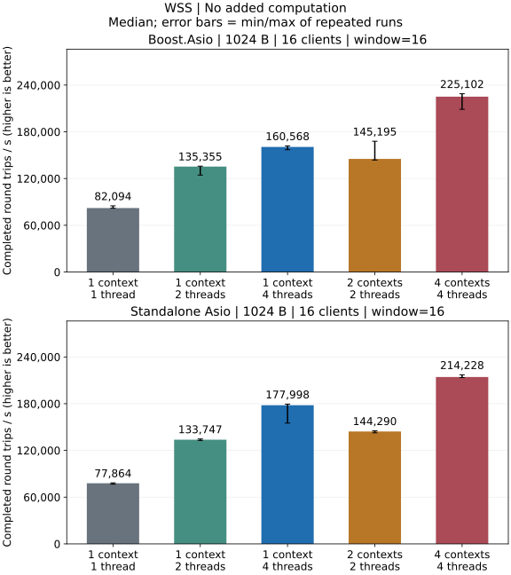
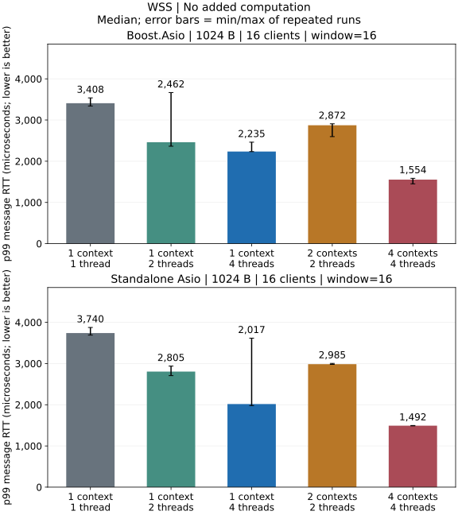

# WSS Local Performance

Measurements come from independent local Release loopback processes, not CI.

[Metric definitions and methodology](../testing.md).

Average process CPU uses 100% for one logical CPU and can exceed 100% with multiple threads; legacy values are marked estimated, and incomplete sets of three CPU samples show N/A. On this 14-logical-CPU host, machine share = process CPU% / 14; 100% of one CPU is 7.14% of the machine.

## No added computation

### All Measured Profiles

#### 64 B / 1 clients / window=1

| Backend / model | Round trips/s | MiB/s | p50 / us | p95 / us | p99 / us | CPU / % | RSS / MiB |
| --- | ---: | ---: | ---: | ---: | ---: | ---: | ---: |
| Boost.Asio / 2 contexts / 2 threads | 46,068 [45,672, 47,126] | 5.62 | 20.38 | 26.50 | 35.83 | 98.5 (estimated) | 14.89 |
| Boost.Asio / 4 contexts / 4 threads | 45,865 [45,500, 46,446] | 5.60 | 20.50 | 26.08 | 34.92 | 98.8 (estimated) | 14.92 |
| Boost.Asio / 1 context / 1 thread | 49,119 [48,765, 49,179] | 6.00 | 19.29 | 27.38 | 35.21 | 88.7 (estimated) | 14.84 |
| Boost.Asio / 1 context / 2 threads | 44,583 [43,831, 46,348] | 5.44 | 21.38 | 28.21 | 40.62 | 129.0 (estimated) | 14.95 |
| Boost.Asio / 1 context / 4 threads | 32,948 [32,662, 33,585] | 4.02 | 28.29 | 38.75 | 55.33 | 158.5 (estimated) | 15.09 |
| Standalone Asio / 2 contexts / 2 threads | 47,357 [47,066, 47,441] | 5.78 | 20.04 | 25.46 | 35.62 | 101.0 (estimated) | 15.17 |
| Standalone Asio / 4 contexts / 4 threads | 46,759 [46,535, 47,104] | 5.71 | 20.29 | 25.67 | 33.71 | 101.1 (estimated) | 15.34 |
| Standalone Asio / 1 context / 1 thread | 49,871 [49,348, 50,287] | 6.09 | 19.04 | 28.58 | 34.04 | 89.7 (estimated) | 15.19 |
| Standalone Asio / 1 context / 2 threads | 44,429 [44,279, 44,673] | 5.42 | 21.46 | 28.33 | 39.88 | 130.6 (estimated) | 15.27 |
| Standalone Asio / 1 context / 4 threads | 32,617 [32,452, 33,063] | 3.98 | 28.71 | 37.67 | 59.75 | 150.5 (estimated) | 15.22 |

#### 1024 B / 1 clients / window=1

| Backend / model | Round trips/s | MiB/s | p50 / us | p95 / us | p99 / us | CPU / % | RSS / MiB |
| --- | ---: | ---: | ---: | ---: | ---: | ---: | ---: |
| Boost.Asio / 2 contexts / 2 threads | 40,311 [40,196, 40,665] | 78.73 | 23.58 | 27.88 | 35.79 | 101.1 (estimated) | 14.94 |
| Boost.Asio / 4 contexts / 4 threads | 39,829 [39,757, 40,695] | 77.79 | 23.62 | 28.54 | 35.42 | 100.5 (estimated) | 14.92 |
| Boost.Asio / 1 context / 1 thread | 46,789 [46,732, 47,103] | 91.38 | 19.83 | 27.21 | 37.29 | 88.6 (estimated) | 14.91 |
| Boost.Asio / 1 context / 2 threads | 38,014 [38,014, 39,298] | 74.25 | 24.46 | 30.75 | 40.46 | 126.0 (estimated) | 14.95 |
| Boost.Asio / 1 context / 4 threads | 30,500 [30,457, 31,791] | 59.57 | 30.54 | 38.71 | 56.50 | 147.6 (estimated) | 14.89 |
| Standalone Asio / 2 contexts / 2 threads | 43,011 [42,901, 43,635] | 84.01 | 21.42 | 28.04 | 36.12 | 101.8 (estimated) | 15.27 |
| Standalone Asio / 4 contexts / 4 threads | 43,070 [42,382, 43,278] | 84.12 | 21.33 | 28.17 | 36.42 | 101.6 (estimated) | 15.17 |
| Standalone Asio / 1 context / 1 thread | 46,985 [46,883, 48,096] | 91.77 | 20.33 | 26.17 | 35.08 | 90.1 (estimated) | 15.08 |
| Standalone Asio / 1 context / 2 threads | 38,191 [36,820, 38,211] | 74.59 | 24.54 | 31.21 | 43.62 | 125.8 (estimated) | 15.30 |
| Standalone Asio / 1 context / 4 threads | 30,354 [30,325, 30,490] | 59.29 | 30.92 | 38.21 | 58.12 | 150.2 (estimated) | 15.39 |

#### 16384 B / 1 clients / window=1

| Backend / model | Round trips/s | MiB/s | p50 / us | p95 / us | p99 / us | CPU / % | RSS / MiB |
| --- | ---: | ---: | ---: | ---: | ---: | ---: | ---: |
| Boost.Asio / 2 contexts / 2 threads | 5,547 [5,547, 5,581] | 173.36 | 171.25 | 192.58 | 216.83 | 75.7 (estimated) | 15.09 |
| Boost.Asio / 4 contexts / 4 threads | 5,552 [5,407, 5,567] | 173.51 | 172.46 | 193.83 | 220.96 | 76.1 (estimated) | 15.05 |
| Boost.Asio / 1 context / 1 thread | 6,291 [6,104, 6,331] | 196.58 | 147.25 | 165.92 | 185.88 | 61.8 (estimated) | 14.94 |
| Boost.Asio / 1 context / 2 threads | 12,135 [12,058, 12,411] | 379.21 | 70.42 | 86.08 | 122.71 | 147.0 (estimated) | 15.17 |
| Boost.Asio / 1 context / 4 threads | 8,612 [8,458, 8,645] | 269.13 | 102.08 | 136.88 | 174.62 | 214.4 (estimated) | 15.25 |
| Standalone Asio / 2 contexts / 2 threads | 5,538 [5,530, 5,553] | 173.07 | 168.58 | 195.04 | 233.92 | 77.6 (estimated) | 15.47 |
| Standalone Asio / 4 contexts / 4 threads | 5,554 [5,552, 5,610] | 173.55 | 168.42 | 192.58 | 225.25 | 77.4 (estimated) | 15.34 |
| Standalone Asio / 1 context / 1 thread | 6,074 [6,063, 6,096] | 189.82 | 152.54 | 172.67 | 196.42 | 61.5 (estimated) | 15.27 |
| Standalone Asio / 1 context / 2 threads | 11,615 [11,498, 11,634] | 362.96 | 74.46 | 88.42 | 125.46 | 146.2 (estimated) | 15.42 |
| Standalone Asio / 1 context / 4 threads | 8,788 [8,384, 8,858] | 274.62 | 98.42 | 135.50 | 177.21 | 210.8 (estimated) | 15.44 |

#### 64 B / 16 clients / window=16

| Backend / model | Round trips/s | MiB/s | p50 / us | p95 / us | p99 / us | CPU / % | RSS / MiB |
| --- | ---: | ---: | ---: | ---: | ---: | ---: | ---: |
| Boost.Asio / 2 contexts / 2 threads | 192,250 [175,990, 200,495] | 23.47 | 1,254.75 | 1,993.62 | 2,337.58 | 198.4 (estimated) | 35.55 |
| Boost.Asio / 4 contexts / 4 threads | 252,537 [241,855, 267,290] | 30.83 | 1,012.88 | 1,243.50 | 1,286.79 | 395.1 (estimated) | 36.02 |
| Boost.Asio / 1 context / 1 thread | 100,069 [99,502, 101,709] | 12.22 | 2,536.08 | 2,715.96 | 2,902.75 | 97.4 (estimated) | 35.42 |
| Boost.Asio / 1 context / 2 threads | 154,293 [138,988, 154,559] | 18.83 | 1,642.75 | 1,901.88 | 2,090.46 | 193.8 (estimated) | 35.61 |
| Boost.Asio / 1 context / 4 threads | 170,278 [165,546, 172,461] | 20.79 | 1,441.46 | 1,920.38 | 2,254.38 | 363.6 (estimated) | 35.83 |
| Standalone Asio / 2 contexts / 2 threads | 172,705 [165,864, 173,198] | 21.08 | 1,376.21 | 2,267.50 | 2,512.67 | 198.6 (estimated) | 36.03 |
| Standalone Asio / 4 contexts / 4 threads | 242,999 [241,687, 245,351] | 29.66 | 1,053.42 | 1,248.38 | 1,294.75 | 396.4 (estimated) | 36.42 |
| Standalone Asio / 1 context / 1 thread | 95,753 [95,049, 95,843] | 11.69 | 2,650.50 | 2,832.04 | 3,015.54 | 99.7 (estimated) | 35.98 |
| Standalone Asio / 1 context / 2 threads | 153,083 [152,977, 154,594] | 18.69 | 1,603.50 | 2,115.58 | 2,448.08 | 197.7 (estimated) | 36.03 |
| Standalone Asio / 1 context / 4 threads | 192,089 [189,945, 198,778] | 23.45 | 1,234.54 | 1,754.83 | 1,904.42 | 387.2 (estimated) | 36.34 |

#### 1024 B / 16 clients / window=16

| Backend / model | Round trips/s | MiB/s | p50 / us | p95 / us | p99 / us | CPU / % | RSS / MiB |
| --- | ---: | ---: | ---: | ---: | ---: | ---: | ---: |
| Boost.Asio / 2 contexts / 2 threads | 145,195 [143,721, 167,918] | 283.58 | 1,550.00 | 2,672.92 | 2,872.33 | 199.0 (estimated) | 36.39 |
| Boost.Asio / 4 contexts / 4 threads | 225,102 [208,872, 228,893] | 439.65 | 1,125.71 | 1,494.21 | 1,553.58 | 397.2 (estimated) | 36.89 |
| Boost.Asio / 1 context / 1 thread | 82,094 [81,933, 84,959] | 160.34 | 3,097.38 | 3,278.00 | 3,407.67 | 94.6 (estimated) | 36.14 |
| Boost.Asio / 1 context / 2 threads | 135,355 [124,418, 135,942] | 264.36 | 1,864.33 | 2,213.62 | 2,462.00 | 195.4 (estimated) | 36.48 |
| Boost.Asio / 1 context / 4 threads | 160,568 [157,002, 161,967] | 313.61 | 1,504.33 | 2,046.54 | 2,235.21 | 369.7 (estimated) | 36.80 |
| Standalone Asio / 2 contexts / 2 threads | 144,290 [142,592, 145,176] | 281.82 | 1,635.46 | 2,736.67 | 2,984.75 | 198.5 (estimated) | 36.70 |
| Standalone Asio / 4 contexts / 4 threads | 214,228 [213,545, 217,103] | 418.41 | 1,172.12 | 1,447.12 | 1,491.67 | 397.5 (estimated) | 42.11 |
| Standalone Asio / 1 context / 1 thread | 77,864 [76,652, 78,341] | 152.08 | 3,260.96 | 3,475.08 | 3,739.62 | 99.5 (estimated) | 36.55 |
| Standalone Asio / 1 context / 2 threads | 133,747 [132,771, 134,695] | 261.22 | 1,840.50 | 2,367.12 | 2,804.96 | 197.9 (estimated) | 36.66 |
| Standalone Asio / 1 context / 4 threads | 177,998 [155,022, 179,441] | 347.65 | 1,345.04 | 1,885.54 | 2,017.00 | 389.7 (estimated) | 37.97 |

#### 16384 B / 16 clients / window=16

| Backend / model | Round trips/s | MiB/s | p50 / us | p95 / us | p99 / us | CPU / % | RSS / MiB |
| --- | ---: | ---: | ---: | ---: | ---: | ---: | ---: |
| Boost.Asio / 2 contexts / 2 threads | 27,428 [23,592, 29,601] | 857.12 | 9,153.67 | 10,818.46 | 11,706.54 | 197.9 (estimated) | 48.28 |
| Boost.Asio / 4 contexts / 4 threads | 43,047 [42,524, 43,361] | 1,345.22 | 5,869.62 | 6,714.21 | 7,012.58 | 384.9 (estimated) | 62.72 |
| Boost.Asio / 1 context / 1 thread | 14,269 [14,073, 14,360] | 445.91 | 17,800.46 | 18,697.88 | 19,819.21 | 96.6 (estimated) | 48.22 |
| Boost.Asio / 1 context / 2 threads | 24,178 [23,704, 24,545] | 755.56 | 10,368.79 | 11,862.96 | 12,620.54 | 196.0 (estimated) | 48.05 |
| Boost.Asio / 1 context / 4 threads | 29,649 [28,303, 31,402] | 926.53 | 8,441.38 | 9,689.67 | 10,220.75 | 367.7 (estimated) | 48.17 |
| Standalone Asio / 2 contexts / 2 threads | 26,700 [26,196, 26,831] | 834.37 | 9,170.42 | 11,300.71 | 12,100.29 | 199.0 (estimated) | 48.09 |
| Standalone Asio / 4 contexts / 4 threads | 41,250 [40,847, 42,032] | 1,289.06 | 6,226.42 | 6,766.92 | 6,979.54 | 390.4 (estimated) | 48.88 |
| Standalone Asio / 1 context / 1 thread | 13,795 [13,688, 13,837] | 431.11 | 18,341.62 | 19,153.75 | 21,286.96 | 98.0 (estimated) | 47.88 |
| Standalone Asio / 1 context / 2 threads | 24,551 [23,839, 24,614] | 767.23 | 10,401.75 | 11,389.29 | 11,687.58 | 197.7 (estimated) | 48.48 |
| Standalone Asio / 1 context / 4 threads | 31,271 [30,987, 31,342] | 977.22 | 8,056.33 | 9,162.50 | 9,669.79 | 383.9 (estimated) | 48.58 |

Tables show repeated-run medians; throughput brackets show min/max, not confidence intervals. Latencies are medians of per-run sampled percentiles, without pooling samples.
