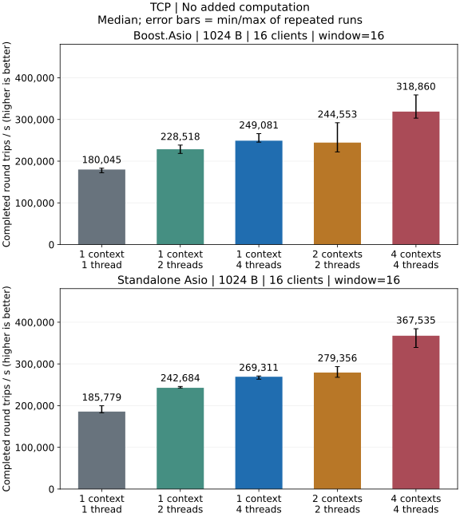
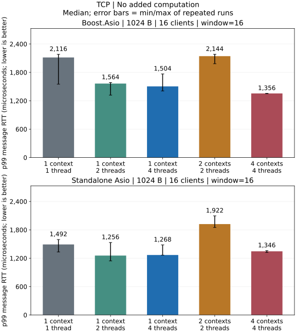

# TCP 性能

## 本机测量结果

Release 本机回环测试：1024 字节消息、16 个客户端、窗口 16，无额外业务计算。





### 本机结论

- 两种后端都以 4 个 io_context 各 1 个线程的吞吐量中位数最高。
- 最低 p99 中位数对应 standalone 的 1 个 io_context、2 个线程，以及 Boost 的 4 个 io_context 各 1 个线程。
- 单客户端、窗口 1 时，两种后端使用 1 个 io_context、4 个线程的吞吐量中位数均低于 1 个 io_context、1 个线程。

[完整 TCP 报告](../performance/tcp_CN.md) · [测试环境](../performance/overview_CN.md) · [指标与统计口径](../testing_CN.md)

[包体、批量与执行方式对比](../performance/dimensions_CN.md#tcp)

## 构建与 IO 模型对比

在仓库根目录使用 Release 构建。使用 Boost 后端时，将 Asio 头文件路径参数替换为 `-DARKNET_USE_BOOST_ASIO=ON`，保持其他设置和硬件一致。

命令采用单配置 generator。使用 Visual Studio 时，在构建命令中加入 `--config Release`，并运行 `benchmarks/Release/` 下的可执行文件。Windows 可执行文件带有 `.exe` 后缀。

```sh
cmake -S . -B build-perf -DCMAKE_BUILD_TYPE=Release \
  -DARKNET_BUILD_BENCHMARKS=ON -DARKNET_ENABLE_SSL=OFF \
  -DARKNET_ASIO_INCLUDE_DIR=/path/to/asio/include
cmake --build build-perf --target arknet_loopback_benchmark arknet_coroutine_benchmark --parallel 3
build-perf/benchmarks/arknet_loopback_benchmark \
  --protocol tcp --payload 1024 --clients 16 --window 16 \
  --io-model shared --io-threads 1 --work 0 --warmup 0.25 --seconds 1
```

这个单配置使用 1024 字节消息、16 个客户端、窗口 16、1 个 io_context 和 1 个线程，
向标准输出写入一条 JSON 结果。将 `--io-threads` 改为 2 或 4 可比较共享 context，
使用 `--io-model sharded --io-threads 4` 可比较 4 个 context 各 1 个线程。
`--work 10000` 表示每次回显增加 10,000 次确定性运算，`0` 表示无额外业务计算，
不等同于真实解析器或业务处理。每组配置用独立进程重复三次；完整 shell 矩阵
见[测试](../testing_CN.md#性能矩阵)。

## 原生 Asio 协程调度基准

```sh
build-perf/benchmarks/arknet_coroutine_benchmark \
  --execution coroutine --protocol tcp --payload 1024 --clients 16 --window 16 \
  --io-model shared --io-threads 1 --work 0 --warmup 0.25 --seconds 1
```

Asio 协程测试程序使用 `awaitable`、`co_spawn` 和固定长度 TCP 批次，详见[协程报告](../performance/coroutine_CN.md)及 [IO 模型](../threading_CN.md)；arknet 的公开协程端点 API 延后提供。窗口大于 1 时报告批次 RTT，与 arknet 回调测试的单消息 RTT、拆包和窗口补充规则不同，应在各自程序内部比较线程模型。`--execution callback` 运行匹配的原生回调模式；两种原生模式使用相同批次协议。

TCP 回调测试使用 `use_dgram` 拆包，不覆盖裸字节流、连接建立速率或真实请求处理器。短时回环结果不能确定跨主机容量、广域网延迟或长期稳定性。

另见[测试及报告元数据](../testing_CN.md)、[回调基准源码](https://github.com/OpenArkStudio/arknet/blob/main/benchmarks/loopback.cpp)及[协程基准源码](https://github.com/OpenArkStudio/arknet/blob/main/benchmarks/coroutine.cpp)。
