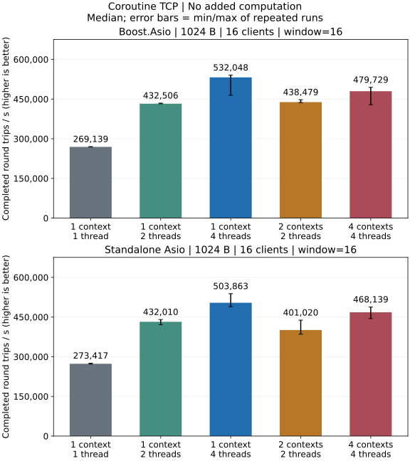
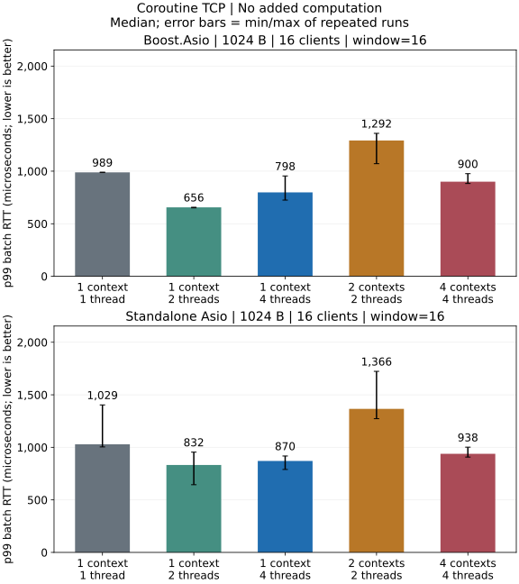
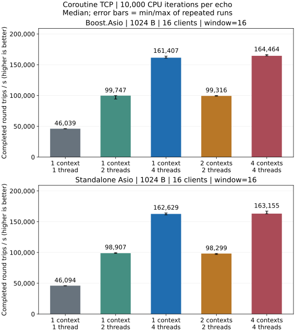
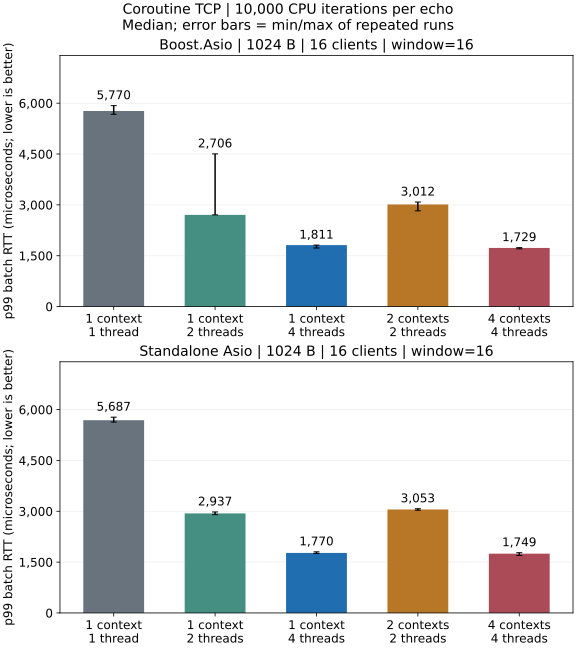

# IO Models and Coroutines

## Native Asio Coroutine Baseline

Native Asio TCP coroutine Release local loopback: 1024-byte messages,
16 clients and window 16. Latency is batch RTT.

### No Extra Application Computation





- One context/four threads has the highest throughput median and one
  context/two threads the lowest batch p99 median for both backends.
- Standalone's batch p99 run ranges overlap between one context/two threads
  and one context/four threads, so these runs do not establish a consistent
  tail-latency advantage.

### 10,000 Deterministic Iterations Per Echo





- Four contexts/one thread each has the highest throughput median and lowest
  batch p99 median for both backends.
- Batch p99 run ranges overlap between one context/four threads and four
  contexts/one thread each for both backends.

[Complete coroutine baseline](performance/coroutine.md) ·
[Payload, batch and execution comparisons](performance/dimensions.md#native-tcp)

[Test environment](performance/overview.md) · [Metrics and statistics](testing.md) ·
[TCP callback results](performance/tcp.md)

## Execution Models

Asio permits one or several threads to call `io_context::run()`. A single runner
implicitly serializes its handlers. Several runners can execute different
handlers concurrently; a strand serializes the handlers associated with it.
Strands do not pin a connection to an operating-system thread.

| Contexts and threads | Suitable workloads | Tradeoff |
| --- | --- | --- |
| One context/one thread | Modest IO traffic, small services, ordered state machines | One long handler delays every connection |
| One context/several threads with independent strands | Many connections with uneven activity | Scheduling one context from several threads adds contention; callbacks can change threads |
| Several contexts/one thread each | Stable partitions, predictable connection loads | A busy partition cannot borrow another partition's thread |

The owned `arknet::io_pool` uses one context and one worker per lane. Its first
lane handles the server listener; sessions use the remaining lanes when present.
`arknet::io_pool` is the public scheduler name; `arknet::iopool` remains an alias.
External contexts may use one or multiple runners. arknet creates a strand for
each supplied external lane and never stops the host context.
Directly constructed `arknet::io_t` lanes use a strand by default. The explicit
`serialize = false` setting requires a single context runner, as used internally
by the owned pool.

Passing one context directly to a server creates one lane: its sessions share
that lane's strand. Supply several lanes to allow concurrent session handlers,
even when all lanes refer to the same context:

```cpp
asio::io_context context;
auto work = asio::make_work_guard(context);
std::vector<asio::io_context*> lanes(5, &context);
arknet::tcp_server server(1024, 16 * 1024 * 1024, lanes);
// Run context.run() on the desired number of host threads.
```

Every client passed the same external context gets its own lane. UDP server
sessions share the datagram socket and its serialized lane. Additional runner
threads therefore do not make one UDP server's receive handlers concurrent.
User state accessed by independent lanes needs synchronization. Avoid relying
on thread-local state across asynchronous operations.

Keep the contexts, runners and work guard alive until all network objects stop.
Stop objects first, release the work guard, then join the host runners. A network
callback should request shutdown and let an owner thread wait for completion.
Let every runner drain before destroying any context: a queued cancellation
handler in one context may retain a session or strand from another context.
See [lifetime and send rules](runtime.md).

## Coroutine Workloads

A coroutine changes how asynchronous control flow is expressed; it does not
create a thread or distribute CPU work. `co_await` releases the runner while an
operation is pending, but computation between suspension points occupies that
runner. A suspended coroutine can resume on a different thread running the
same context. Spawn it on a strand when other operations access the same connection
state; a sequential coroutine alone does not serialize those other operations.

| Business workload | Starting choice | Reason |
| --- | --- | --- |
| IO-bound gateway, chat or HTTP clients | One context/several threads with per-connection strands | Independent connections can use available threads as activity changes |
| Small agent or control-plane service | One context/one thread | Serial state handling with low scheduling overhead |
| Partitioned game sessions or tenant workers | One context and thread per partition | Explicit ownership and stable assignment of application state |
| Compression, parsing or expensive request computation | Either IO model plus a bounded CPU executor | Long CPU tasks otherwise delay unrelated IO; awaiting their results keeps IO runners available |

These are starting choices, not universal rankings. One busy connection remains
serialized by its strand in either model. More IO runners cannot parallelize its
state machine. Measure the actual connection distribution and handler cost.
The first release provides callback-based arknet endpoints; the coroutine
benchmark uses native Asio `awaitable`/`co_spawn` to test scheduler choices.
A public coroutine endpoint API is deferred.

## Reproducing the Comparison

The checked-in programs `benchmarks/loopback.cpp` (arknet callbacks) and
`benchmarks/coroutine.cpp` (native Asio callbacks/coroutines) each have an
independent `main`. Build with CMake and run the C++ executable directly:

```sh
cmake -S . -B build-perf -DCMAKE_BUILD_TYPE=Release \
  -DARKNET_BUILD_BENCHMARKS=ON -DARKNET_ENABLE_SSL=OFF \
  -DARKNET_ASIO_INCLUDE_DIR=/path/to/asio/include
cmake --build build-perf --target arknet_coroutine_benchmark --parallel 3
build-perf/benchmarks/arknet_coroutine_benchmark \
  --execution coroutine --protocol tcp --payload 1024 --clients 16 --window 16 \
  --io-model shared --io-threads 4 --work 0 --warmup 0.25 --seconds 1
```

This example uses one context/four threads, 1024-byte messages, 16 clients and
window 16, writing JSON to standard output. Replace the Asio include argument
with `-DARKNET_USE_BOOST_ASIO=ON` for Boost. With Visual Studio, add
`--config Release` and run the `.exe` under `benchmarks/Release/`.

The `--io-model` values `shared` and `sharded` select one context with multiple
threads and one context per thread, respectively. Set `--io-threads 1` to test
one context/one thread. `--execution callback` runs the matched native callback
mode. `--work 10000` adds 10,000
deterministic iterations per server echo; `0` adds no application computation.
This is a synthetic load, not a production parser or crypto algorithm. Compare
topologies within the same benchmark program, backend, payload, concurrency and
computation setting. The Asio coroutine program sends and reads fixed-size batches:
with `--window` above one, its latency is batch RTT. The arknet callback program continuously
replenishes its window and reports individual-message RTT. Their throughput and
latency do not establish a coroutine-versus-callback speedup.

The expanded comparison runs callback and coroutine modes of the same native
Asio TCP program. Its server reads a complete batch, performs the configured
computation on each message, then writes the full reply. Window 1 measures
message RTT; larger windows measure batch RTT. See the
[matched comparison](performance/dimensions.md#native-tcp).

Repeat configurations in fresh C++ processes, or use the maintainer's shell
matrix in [Testing](testing.md#performance-matrix). Only that batch tool needs
`jq`, GNU `timeout` and `shasum`; direct C++ tests and single benchmarks do not.

Raw results and test commands are documented in [Testing and Performance](testing.md).
Short loopback measurements cannot predict WAN latency or production capacity.

## Asio References

- [Threads and Asio](https://think-async.com/Asio/asio-1.38.2/doc/asio/overview/core/threads.html)
- [Strands](https://think-async.com/Asio/asio-1.38.2/doc/asio/overview/core/strands.html)
- [C++20 Coroutines](https://think-async.com/Asio/asio-1.38.2/doc/asio/overview/composition/cpp20_coroutines.html)
