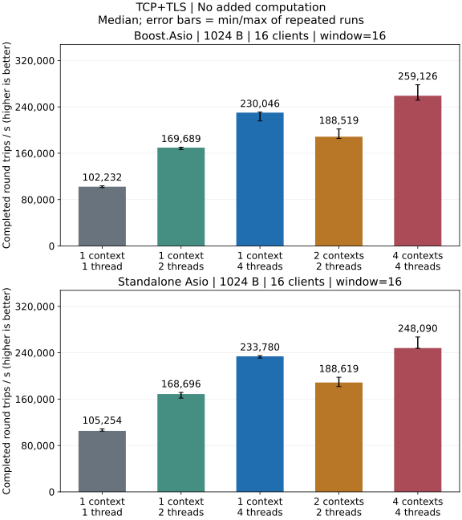
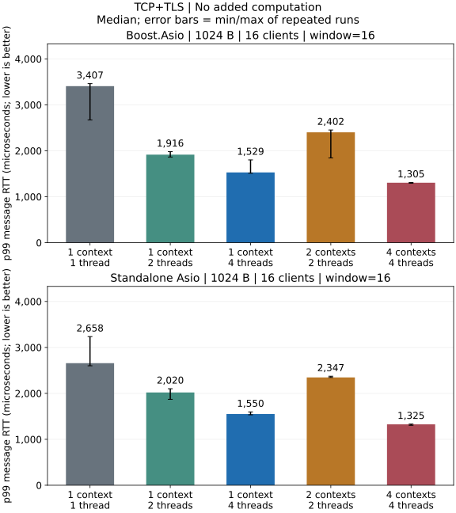

# TLS Performance

## Local TCPS Results

Release local loopback after TLS handshake: 1024-byte messages, 16 clients,
window 16 and no extra application computation.





### What This Run Shows

- Four contexts/one thread each has the highest throughput median and lowest
  p99 median for both backends.
- With one client and window 1, one context/one thread has the best throughput
  and p99 medians for both backends. The benefit of extra threads depends on
  concurrency.

[Complete TCPS report](../performance/tcps.md) · [WSS report](../performance/wss.md) ·
[HTTPS report](../performance/https.md)

[Test environment](../performance/overview.md) · [Metrics and statistics](../testing.md)

[Payload, batch and execution comparisons](../performance/dimensions.md#tcps)

## Build and Reproduce

Use a Release build from the repository root. Replace the standalone include
argument with `-DARKNET_USE_BOOST_ASIO=ON` for Boost. Both backends must use the
same OpenSSL version, host and build options for a meaningful comparison.

Commands assume a single-configuration generator. With Visual Studio, add
`--config Release` to the build command and run the executable under
`benchmarks/Release/`. Windows executables end in `.exe`.

```sh
cmake -S . -B build-perf-tls -DCMAKE_BUILD_TYPE=Release \
  -DARKNET_BUILD_BENCHMARKS=ON -DARKNET_ENABLE_SSL=ON \
  -DARKNET_ASIO_INCLUDE_DIR=/path/to/asio/include
cmake --build build-perf-tls --target arknet_loopback_benchmark --parallel 3
for repetition in 1 2 3; do
  for protocol in tcp tcps websocket wss http https; do
    build-perf-tls/benchmarks/arknet_loopback_benchmark \
      --protocol "$protocol" --certs tests/certs \
      --payload 1024 --clients 16 --window 16 \
      --io-model shared --io-threads 1 --work 0 --warmup 0.25 --seconds 1 \
      > "build-perf-tls/${protocol}-${repetition}.json" || exit 1
  done
done
```

This loop collects three fresh-process measurements per plaintext/TLS protocol,
using 1024-byte messages, 16 clients, window 16 and one context/one thread,
saving each result separately. Change `--io-threads` to 2 or
4 for a shared context, or use `--io-model sharded --io-threads 4` for four
contexts/one thread each. `--work 10000` adds 10,000 deterministic iterations per
echo; `0` adds no application computation. The complete shell matrix is in
[Testing](../testing.md#performance-matrix). Encryption for one connection still
executes through its serialized lane.

The server uses the test certificate/key and the client trusts its test CA,
verifying the chain and IP identity. Public certificates are for local testing;
mTLS correctness is covered separately by
[TLS tests](https://github.com/OpenArkStudio/arknet/blob/main/tests/tls.cpp).

Compare TCP/TCPS, WebSocket/WSS or HTTP/HTTPS with matching message size,
concurrency, computation, backend and thread model. TCP uses `use_dgram`,
WebSocket uses binary frames, and HTTP uses persistent connections.

The test excludes handshake rate, connection churn, session resumption,
certificate rotation, cipher-suite and mTLS throughput; JSON does not record
the negotiated cipher suite. End-to-end differences include parsing and
encryption, and steady-state loopback results do not establish churn capacity
or cross-host capacity.

See [IO models](../threading.md) and
[benchmark source](https://github.com/OpenArkStudio/arknet/blob/main/benchmarks/loopback.cpp).
