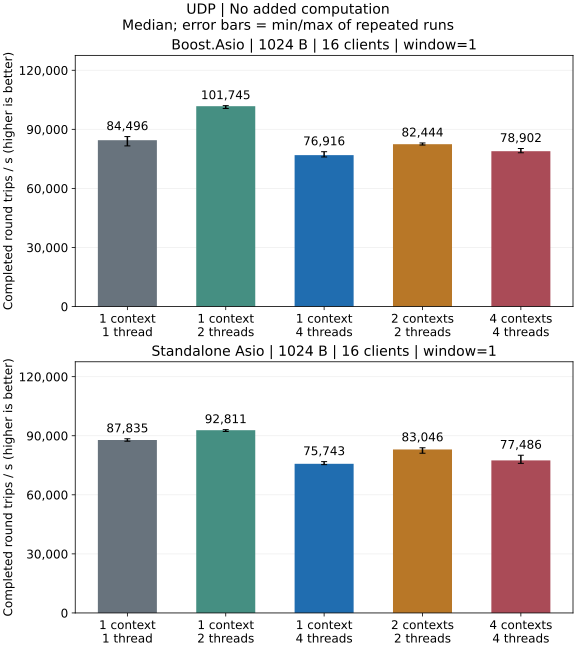
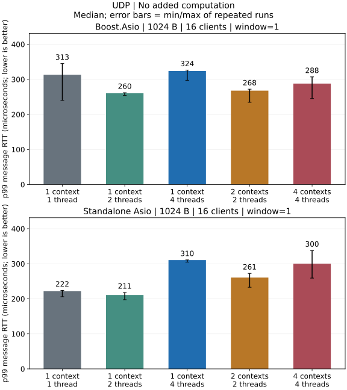

# UDP Performance

## Local Results

Release local loopback: 1024-byte datagrams, 16 clients, window 1 and no extra
application computation.





### What This Run Shows

- One context/two threads has the highest throughput median and lowest p99
  median for both backends. Its p99 run ranges overlap the single-thread model,
  so these runs do not establish consistently lower tail latency.
- One context/four threads and four contexts/one thread each have lower
  throughput medians than one context/one thread. The server uses one socket
  and a serialized receive lane; extra threads cannot execute its receive
  callbacks concurrently.

[Complete UDP report](../performance/udp.md) ·
[Test environment](../performance/overview.md) ·
[Metrics and statistics](../testing.md)

[Payload, batch and execution comparisons](../performance/dimensions.md#udp)

## Build and Run

Run from the repository root with a Release build. Replace the Asio include path
with `-DARKNET_USE_BOOST_ASIO=ON` to test Boost under the same conditions.

Commands assume a single-configuration generator. With Visual Studio, add
`--config Release` to the build command and run the executable under
`benchmarks/Release/`. Windows executables end in `.exe`.

```sh
cmake -S . -B build-perf -DCMAKE_BUILD_TYPE=Release \
  -DARKNET_BUILD_BENCHMARKS=ON -DARKNET_ENABLE_SSL=OFF \
  -DARKNET_ASIO_INCLUDE_DIR=/path/to/asio/include
cmake --build build-perf --target arknet_loopback_benchmark --parallel 3
build-perf/benchmarks/arknet_loopback_benchmark \
  --protocol udp --payload 1024 --clients 16 --window 1 \
  --io-model shared --io-threads 1 --work 0 --warmup 0.25 --seconds 1
```

This configuration sends 1024-byte datagrams from 16 clients, with one
outstanding message per client and one context/one thread. It writes JSON to
standard output. Repeat each configuration three times in fresh processes.
Change `--io-threads` to 2 or 4 for a shared context, or use
`--io-model sharded --io-threads 4` for four contexts/one thread each.
`--work 10000` adds 10,000 deterministic iterations to each server echo;
`0` adds no application computation. The complete shell matrix is in
[Testing](../testing.md#performance-matrix).

The benchmark program requests a 65536-byte socket send buffer and a 4 MiB receive buffer
for its UDP endpoints. JSON reports the actual OS values, including client
minimum/maximum sizes; these may be clamped. This is benchmark setup, not a
change to arknet's socket defaults.

## Probe a Larger Window

Run an explicit high-window case to expose queueing or loss under a more
aggressive offered load:

```sh
build-perf/benchmarks/arknet_loopback_benchmark \
  --protocol udp --payload 1024 --clients 16 --window 16 \
  --io-model shared --io-threads 4 --work 0 --warmup 1 --seconds 3
```

## Datagram Size and MTU

| Ordinary UDP payload | IPv4 | IPv6 |
| --- | ---: | ---: |
| Protocol maximum | 65,507 bytes | 65,527 bytes |
| Without fragmentation at MTU 1,500 | 1,472 bytes | 1,452 bytes |
| Mathematical budget at MTU 16,384 | 16,356 bytes | 16,336 bytes |

These budgets assume no IP options or extension headers and exclude IPv6
jumbograms. IPv4 and IPv6 use different IP headers; these sizes are not
interchangeable.

The [IPv4 boundary and burst-loss report](../performance/udp-limits.md) shows
36 passing and 18 failing runs per backend at 16 clients/one context/one thread.
65,507-byte messages pass at window 1; 16 KiB passes at window 16 but loses
767 echoes per run at window 64. Socket buffer drops increase by 23,778 per
backend while IPv4 fragmentation/reassembly counters stay at zero. The local
MTU calculation therefore does not establish fragmentation as the loss cause.
These results do not measure IPv6 loss or cross-host behavior.

The original baseline uses UDP window 1 while TCP and WebSocket use window 16, so these results do
not support a direct capacity ranking across protocols; loss invalidates a
larger-window measurement. Broadcast, multicast, KCP, DTLS and cross-host
networks are outside this test; validate pacing, loss, reordering and MTU on
the deployed network.

See [testing](../testing.md), [IO models](../threading.md) and
[benchmark source](https://github.com/OpenArkStudio/arknet/blob/main/benchmarks/loopback.cpp).
